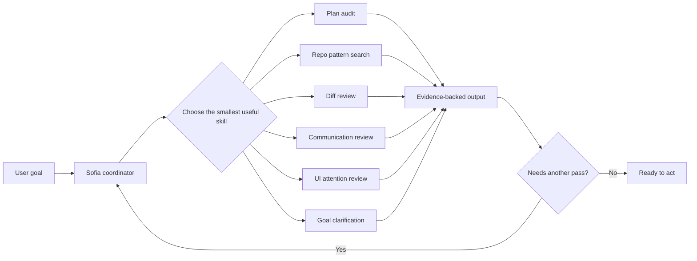

# World of Sofia

World of Sofia is a practical Codex skill collection for engineers who want better planning, codebase orientation, review, communication, and UI validation workflows.

Install the skills, ask for the kind of work you need, and let Sofia act as the coordinator behind the skills: a practical guide that routes the job to the right specialist instead of blending every responsibility into one prompt.

## What this is

- A set of isolated, installable Codex skills under `skills/<slug>`.
- A small toolkit for validating, testing, creating, and installing those skills.
- A coordination model named Sofia that helps decide which skill should handle each part of the work.
- A philosophy-inspired project, but the day-to-day value is practical: clearer plans, better reuse decisions, sharper reviews, cleaner communication, and focused UI checks.

## Install

```bash
npm install
npm run validate:skills
npm run install:skills
```

The installer copies every validation-valid folder from `skills/<slug>` into `$CODEX_HOME/skills` when `CODEX_HOME` is set, otherwise into `~/.codex/skills`. Existing target skills are backed up under `.backups/world-of-sofia/<slug>-<timestamp>` before they are replaced.

To install or update one skill:

```bash
npm run install:skill -- audit-plan-descartes
```

Rerun the install command whenever skills change. Open a new Codex session if an installed or updated skill does not appear immediately.

## Use Sofia to route work

Sofia is the practical wizard behind the skill set. She is not a separate installable skill in this repo yet; she is the coordination character and workflow model that keeps each specialist focused on its job.



Use Sofia when the work spans more than one concern:

- Planning a change before implementation.
- Finding existing code patterns before adding new code.
- Reviewing a real diff before merge.
- Tightening a user-facing message.
- Checking whether a rendered UI draws attention to the right thing.
- Clarifying a vague goal before other skills act on it.

## Skill map

| Skill | Use when | Inspects | Produces |
| --- | --- | --- | --- |
| [Audit Plan Descartes](skills/audit-plan-descartes) | A plan needs stronger assumptions, evidence, or risk handling. | User request, repo facts, constraints, unresolved assumptions. | Foundation ledger, assumption audit, final plan support. |
| [Pattern Code Wittgenstein](skills/pattern-code-wittgenstein) | You need to know how this repo already solves something before coding. | Nearby files, naming, structure, helper APIs, bounded contexts. | Reuse decision: `reuse`, `extend`, `extract`, `copy carefully`, or `create new`. |
| [Synthesis Code Hegel](skills/synthesis-code-hegel) | Code has changed and needs review before merge or cleanup. | Diffs, affected modules, duplicated behavior, context boundaries. | Review findings and synthesis recommendation: leave, rename, extract, merge, split, inline, deprecate, or delete. |
| [Communication Review Ciceron](skills/communication-review-ciceron) | A message, comment, review, or proposal needs to land better. | Wording, implied intent, audience uptake, tone, clarity. | Direct communication feedback and smallest useful rewrite. |
| [Grill Me Aquinas](skills/grill-me-aquinas) | A request is fuzzy, learning looks wrong, or user/project truth needs rebuilding. | User wording, project docs, code evidence, prior decisions, case clusters, and memory conflicts. | Question ladder output, practical truth mode, potency-to-truth checks, relearning repairs, essence candidates, rules, exceptions, and handoffs. |
| [UI Attention Ciceron](skills/ui-attention-ciceron) | A UI change needs final attention and language validation. | Rendered UI, screenshots, DOM evidence, hierarchy, CTA copy. | Attention ranking, goal-fit review, severity, and smallest useful correction. |

## Common workflows

| Workflow | Practical sequence |
| --- | --- |
| Plan a feature | Sofia -> Audit Plan Descartes -> Pattern Code Wittgenstein -> implementation. |
| Add code safely | Pattern Code Wittgenstein -> implementation -> Synthesis Code Hegel -> tests. |
| Review a PR | Synthesis Code Hegel -> targeted fixes -> validation. |
| Improve a UI | Sofia -> implementation -> UI Attention Ciceron -> smallest useful correction. |
| Clarify a messy request | Grill Me Aquinas -> Sofia route -> selected specialist skill. |
| Repair bad learning | Grill Me Aquinas Relearning Mode -> review proposed memory revision -> Sofia route. |
| Rewrite a sensitive message | Communication Review Ciceron -> revised message -> optional Sofia handoff. |

## Commands

```bash
npm install
npm run validate:skills
npm run validate:skill-traces
npm run check:isolation
npm run test
npm run check
```

Create a new skill from the template:

```bash
npm run new:skill -- "Stoic Triage" "Epictetus"
npm run validate:skills
npm run check:isolation
npm run test
```

The legacy `sync:skills` and `sync:skill` aliases are still available and run the same installer as `install:skills` and `install:skill`.

## Repository layout

- `skills/<slug>`: one self-contained skill per folder.
- `scripts`: skill creation, validation, installation, and repository analysis tools.
- `scripts/lib`: shared root helpers for skill validation and loading.
- `templates/skill`: source template for new skills.
- `docs`: architecture notes and evaluation cases.

The hard rule is isolation: every skill carries its own manifest, instructions, README, and references so it can be copied and installed without private files from another skill.

## Philosophy behind the names

The philosopher names are memory handles for practical engineering habits:

| Name | Practical habit |
| --- | --- |
| Descartes | Separate known facts, constraints, assumptions, and missing evidence before trusting a plan. |
| Wittgenstein | Understand meaning through actual repo use before inventing new code patterns. |
| Hegel | Review changed code by preserving what works, transforming what no longer fits, and removing what is obsolete. |
| Ciceron | Judge communication and UI language by how they direct attention and affect the audience. |
| Aquinas | Separate what defines the goal from what merely happened, then build practical truth from potency, evidence, and relearning. |
| Sofia | Coordinate the specialists so each skill keeps its own job and hands off cleanly. |
