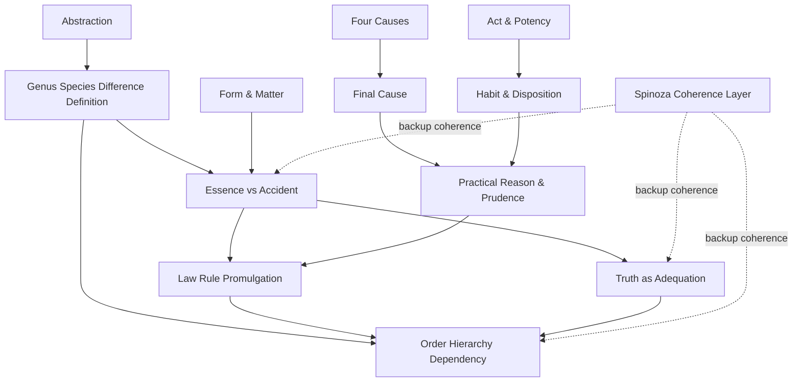
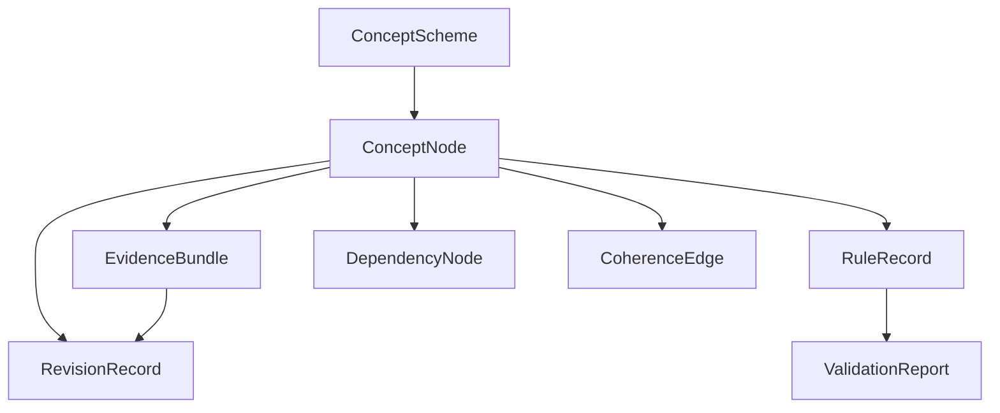

# Aquinas-Based Essence Codex for Passive AI Learning

## Executive Summary

For the specific problem you describe—an AI skill that **learns passively from user expression**, infers **stable cross-project preferences**, and builds a **codex of essences rather than just local stylistic patterns**—**Aquinas is the stronger primary framework**. Aquinas gives you a layered architecture for distinguishing what a thing **is** from what merely happens to be true of it, what is **actual** from what is only **possible**, what is a repeated **habit** versus a promulgated **rule**, and what is a **prudential application** of a principle in context rather than a brute deduction. Those distinctions are unusually well-suited to building a durable, auditable knowledge system rather than an undifferentiated preference memory. citeturn13view0turn13view1turn11view1turn12view3turn12view1turn12view8turn17view0

**Spinoza is useful, but mainly as a backup coherence layer.** He is strong where you need global intelligibility, cross-context invariants, and a way to measure whether ideas are becoming more adequate, but he is weak as a primary design frame for your use case because he tends to turn contingency into necessity, explains things through efficient causation, and explicitly resists final-cause thinking. That makes him excellent for **system-wide consistency checks** and **coherence scoring**, but less suitable than Aquinas for modeling rule authority, practical ends, exception handling, or the difference between core identity and accidental drift. citeturn9view2turn11view6turn29view0turn29view1turn33view0

The most productive modern translation is therefore: **Aquinas for ontology, governance, and practical inference; Spinoza for coherence control and fallback integration**. In implementation terms, that means using Aquinas to decide what becomes a class, definition, invariant, rule, or prudential exception, while using Spinoza to detect common notions across domains, mark weakly grounded but globally stable regularities, and downgrade fragmented or mutilated patterns. This hybrid approach also matches modern ontology engineering practice, which treats ontologies as **application-relative, iterative, structured representations** rather than timeless mirrors of reality, and it fits W3C standards for concept schemes, formal ontologies, provenance, and validation. citeturn20view0turn20view2turn20view3turn9view4turn10view4turn9view5turn10view0turn9view6turn9view7turn23view0

## Why Aquinas Should Be the Base and Spinoza the Backup

The deepest difference between the two authors is not merely historical; it is architectural. **Aquinas is a discriminating system-builder**: he distinguishes essence from accident, substance from accident, form from matter, act from potency, habit from law, truth from mere apprehension, and prudence from abstract rule. He also places sciences and principles in ordered relations of dependency. That makes him ideal for an AI codex that must separate **identity**, **structure**, **capacity**, **rule**, **evidence**, and **context-sensitive application**. citeturn13view0turn13view1turn11view0turn11view1turn12view3turn34view1turn35view2turn12view8turn17view0

**Spinoza is a global coherence philosopher**. He is strongest when the task is to understand how fragmented data can become more adequate by being situated within a wider causal order; how minds move from imagination to common notions; and how stable striving can explain persistence across changing contexts. Those are genuinely valuable tools for AI memory, but they do not by themselves tell you how to separate a constitutive project invariant from a contextual preference, or a promulgated rule from an emergent tendency. citeturn9view2turn11view6turn29view1turn33view0

So the design verdict is straightforward: **use Aquinas to build the codex ontology; use Spinoza to prevent fragmentation, overfitting, and incoherent localism**. If the system cannot confidently derive a Thomistic essence, it should fall back to a Spinozist “common notion” or coherence relation rather than prematurely hardening a pattern into an essential rule. That preserves flexibility without collapsing everything into probabilistic drift. That recommendation is also consistent with modern conceptual engineering, which increasingly treats concepts as devices to be **evaluated and improved by function**, not merely described. citeturn28view0turn28view1turn28view2

## Concept to Mechanism Map

The table below is a design synthesis: it maps Thomistic distinctions into concrete AI responsibilities, while reserving Spinoza for fallback coherence and adequacy control. The philosophical side is grounded in Aquinas and Spinoza; the technical side is aligned with RDF/SKOS/OWL, provenance, validation, ontology iteration, and knowledge-graph evolution. citeturn13view0turn11view1turn12view1turn35view2turn17view0turn9view4turn9view5turn9view6turn9view7turn20view0turn23view0turn26view1turn27view0

| Concept | What it does in the codex | Preferred mechanism |
|---|---|---|
| Essence vs Accident | Separates constitutive invariants from local stylistic features | Core constraints vs annotations |
| Form & Matter | Separates structural pattern from observed substrate/content | Schema layer vs instance layer |
| Act & Potency | Tracks latent capacities before they become stable facts | Candidate state vs actualized state |
| Four Causes | Forces multi-angle explanation of any codex rule | Input, structure, provenance, goal profile |
| Final Cause | Binds concepts and rules to project function | Goal/competency-question linkage |
| Genus/Species/Difference/Definition | Builds taxonomic discipline | SKOS + OWL class design |
| Abstraction | Moves from repeated particulars to reusable concepts | Exemplar clustering + concept formation |
| Analogy/Univocity/Equivocity | Handles reused words across related but different domains | Sense mappings and analogical links |
| Habit/Disposition | Learns stable user tendencies from repeated action | Preference accumulation and decay |
| Law/Rule/Promulgation | Distinguishes draft tendencies from binding norms | Versioned rule registry with authority |
| Truth as Adequation | Assesses whether codex claims fit evidence and reality | Provenance + validation + contradiction checks |
| Practical Reason & Prudence | Applies general rules to concrete cases | Context evaluation and exception handling |
| Order/Hierarchy/Dependency | Prevents flat, chaotic memory | Layered graph with dependency edges |
| Spinoza coherence layer | Stops local memories from drifting apart | Common-notion and adequacy checks |

## YAML Research Feed

### Essence versus Accident

Aquinas treats **essence** as what is signified by a definition and what places a thing within genus and species; by contrast, accidents are secondary and depend on substance. Modern metaphysics often reconstructs essentiality in modal terms, but contemporary discussion also revives a more definitional or nature-based view. In ontology engineering, this maps naturally onto the difference between **identity-bearing constraints** and **contingent descriptive metadata**. citeturn13view0turn13view1turn9view1turn20view0turn20view3

```yaml
element_number: 1
element_name: "Essence vs Accident"

1_original_aquinas_thought:
  core_definition: "Essence is what a thing is, as signified by its definition; an accident is a non-essential determination that depends on a subject."
  key_terms: ["essentia", "quidditas", "natura", "substantia", "accidens", "per se", "per accidens"]
  primary_sources:
    - "De ente et essentia, ch. 1-2"
    - "Summa Theologiae I, q.16"
  role_in_aquinas_system: "Provides the identity layer of things and distinguishes constitutive nature from contingent predicates."
  what_to_preserve:
    - "Definition-centered account of essence"
    - "Strict separation between core identity and contingent features"
    - "Priority of substance-like structure over accidental variation"
  what_to_exclude:
    - "Overly rigid natural-kind essentialism in application domains"
    - "Treating every frequent feature as essential"
    - "Theological extension beyond system needs"

2_later_or_modern_development:
  later_interpretations:
    - "Modal essentialism recasts essence as what an object must have if it exists."
    - "Neo-Aristotelian approaches recover definition/nature as stronger than bare modality."
  modern_improvements:
    - "Represent essence as identity constraints, and accidents as annotations or defeasible properties."
    - "Use competency questions to test which predicates are truly constitutive for the application."
  useful_critiques:
    - "Modern domains are purpose-relative; not all classification has one uniquely correct essence."
    - "Essentialization can smuggle in bias or freeze revisable project choices."
  relation_to_ai_or_knowledge_systems:
    - "Maps to the difference between schema-level invariants and context-level attributes."
    - "Supports cross-project memory by preventing style drift from being mistaken for identity."

3_translation_to_skill:
  ai_problem_solved: "Distinguishes project-wide invariants from local habits, tone, or situational choices."
  passive_learning_signals:
    - "Repeated explicit definitions"
    - "User corrections that reject alternatives across contexts"
    - "Cross-domain reuse of the same criterion"
    - "Presence in templates, checklists, or acceptance gates"
  inference_rule: "Promote a predicate to essence only if it appears in definitions or exclusion rules across multiple contexts; otherwise store it as accidental until stabilized."
  codex_storage_format:
    essence_claim:
      predicate: ""
      support_type: ["definition", "constraint", "cross-domain recurrence"]
      scope: ["project", "domain", "local"]
    accident_claims:
      - predicate: ""
        context: ""
  confidence_model:
    essence_threshold: 0.85
    accident_threshold: 0.40
    required_evidence: "At least 3 independent contexts, with at least 1 explicit definitional cue"
  revision_model: "Essence claims require explicit supersession with provenance; accidents may update incrementally."
  cross_domain_use: "Useful for deciding whether a writing preference, data standard, or naming convention should govern unrelated modules."
  example:
    input_pattern: "User repeatedly says 'all public-facing text must preserve legal precision even when tone changes.'"
    codex_result:
      essence_claim: "legal_precision(public_output)"
      accident_claims: ["friendly_tone", "short_sentences"]

4_spinoza_backup:
  relevant_spinoza_concept: ["adequate ideas", "common notions"]
  when_to_use: "When no clear definition exists but a stable invariant appears across many contexts."
  how_it_improves_aquinas: "Prevents premature hardening by allowing a relation to remain globally coherent before being treated as essential."
  risk_if_overused: "Can flatten important distinctions and turn stable co-occurrence into pseudo-essence."

5_design_principle:
  one_sentence_rule: "Only harden into essence what remains necessary for project identity after context, tone, and task are varied."
  implementation_hint: "Store essence in a locked constraint layer and accidents in a defeasible annotation layer."
  failure_mode_to_avoid: "Confusing frequent style with constitutive identity."
```

### Form and Matter

For Aquinas, material substances are composites of **matter and form**; form is the organizing principle, while matter is what is organized. In modern ontology terms, this is close to the distinction between **structure/schema** and **instances/content substrate**. W3C standards support this split by distinguishing vocabularies, classes, and property restrictions from the data that instantiate them. citeturn11view0turn36view1turn9view3turn21view0turn10view0

```yaml
element_number: 2
element_name: "Form & Matter"

1_original_aquinas_thought:
  core_definition: "Matter is that which is structured; form is the intelligible principle that makes a thing the kind of thing it is."
  key_terms: ["materia", "forma", "materia signata", "materia non signata", "forma substantialis", "forma accidentalis"]
  primary_sources:
    - "De ente et essentia, ch. 2"
    - "Summa Theologiae I, q.3"
  role_in_aquinas_system: "Explains how concrete beings are structured and why the same kind can exist in many individuals."
  what_to_preserve:
    - "Structure/substrate distinction"
    - "Difference between core form and accidental modification"
    - "Individuation through designated matter"
  what_to_exclude:
    - "Prime matter as a required software object"
    - "Metaphysical commitments unnecessary for implementation"

2_later_or_modern_development:
  later_interpretations:
    - "Contemporary hylomorphism revives form as organization rather than mere shape."
    - "Ontology engineering translates form into schema and matter into instance data."
  modern_improvements:
    - "Represent stable structural roles in OWL or RDF Schema."
    - "Keep concrete observations in a separate instance layer."
  useful_critiques:
    - "Schema can drift if treated as timeless rather than iterative."
    - "Some domains need multiple overlapping forms, not one rigid hierarchy."
  relation_to_ai_or_knowledge_systems:
    - "Useful for separating templates, argument structures, or editorial policies from individual texts or files."

3_translation_to_skill:
  ai_problem_solved: "Allows the system to learn a stable common language without collapsing all evidence into raw examples."
  passive_learning_signals:
    - "Repeated structural patterns across different artifacts"
    - "Same relational arrangement with different surface content"
    - "User corrections to structure rather than wording"
  inference_rule: "When many different instances share the same organization, infer a form-schema; keep instance content as matter."
  codex_storage_format:
    form_schema:
      relations: []
      required_slots: []
      prohibited_slots: []
    matter_instances:
      - example_id: ""
        fills_slots: {}
  confidence_model:
    form_threshold: 0.80
    evidence_requirement: "Shared relation pattern across at least 4 heterogeneous instances"
  revision_model: "Revise form only when many instance-level exceptions cluster; otherwise revise instances, not schema."
  cross_domain_use: "Supports cross-project transfer of structure even when vocabulary and media change."
  example:
    input_pattern: "The user writes briefs, prompts, and memos differently, but always separates scope, constraints, and decision criteria."
    codex_result:
      form_schema: ["scope", "constraints", "decision_criteria"]
      matter_instances: ["brief_A", "memo_B", "prompt_C"]

4_spinoza_backup:
  relevant_spinoza_concept: ["common notions"]
  when_to_use: "When structure emerges from many materials but cannot yet be cleanly defined."
  how_it_improves_aquinas: "Lets the system mark a cross-instance organizational invariant before fixing a formal schema."
  risk_if_overused: "Can delay necessary schema hardening."

5_design_principle:
  one_sentence_rule: "Learn structure separately from content."
  implementation_hint: "Maintain one schema graph for forms and one evidence graph for material instances."
  failure_mode_to_avoid: "Letting volatile examples rewrite stable structure too quickly."
```

### Act and Potency

Aquinas distinguishes **act** from **potency**, and further distinguishes first and second act as well as active and passive potency. That gives a powerful way to model not only what is true now, but what a user or project is **disposed to actualize** under the right circumstances. This is especially valuable for passive learning, where many preferences appear first as latent regularities before they become explicit rules. citeturn11view1turn6search5turn6search8

```yaml
element_number: 3
element_name: "Act & Potency"

1_original_aquinas_thought:
  core_definition: "Potency is a real capacity or receptivity; act is the realized state or operation of that capacity."
  key_terms: ["actus", "potentia", "actus primus", "actus secundus", "potentia activa", "potentia passiva"]
  primary_sources:
    - "Summa Theologiae I, q.25"
    - "Thomas Aquinas, IEP overview on act and potency"
  role_in_aquinas_system: "Explains change, development, and the difference between having a power and exercising it."
  what_to_preserve:
    - "Latent capacity vs realized operation"
    - "Difference between active capability and passive susceptibility"
  what_to_exclude:
    - "Treating every unrealized possibility as equally important"
    - "Over-metaphysical perfection language"

2_later_or_modern_development:
  later_interpretations:
    - "Modern systems modeling often distinguishes capability, state, and execution."
    - "Dynamic knowledge graphs track changing states rather than only static facts."
  modern_improvements:
    - "Use distinct states: candidate, disposition, actualized, deprecated."
    - "Represent temporal change explicitly."
  useful_critiques:
    - "Potential states can proliferate and create noise if thresholds are too low."
  relation_to_ai_or_knowledge_systems:
    - "Supports anticipation without overcommitting."
    - "Useful for latent preferences, emerging taxonomies, and draft rule candidates."

3_translation_to_skill:
  ai_problem_solved: "Captures passive learning before explicit rule promulgation."
  passive_learning_signals:
    - "Near-repeated choices not yet universal"
    - "Draft conventions"
    - "Deferred constraints"
    - "Consistent acceptance of some outputs and rejection of others"
  inference_rule: "Store as potency when the pattern is recurrent but not yet decisive; promote to act when it governs successful outputs across contexts."
  codex_storage_format:
    potency_state:
      candidate_rule: ""
      activation_conditions: []
      evidence_count: 0
    act_state:
      actual_rule: ""
      active_since: ""
  confidence_model:
    potency_threshold: 0.55
    act_threshold: 0.80
    promotion_condition: "At least 5 successful enactments across 2 or more domains"
  revision_model: "Actualized rules regress to potency if contradicted by sustained later evidence."
  cross_domain_use: "Useful for evolving editorial rules, data normalization habits, and interaction rituals."
  example:
    input_pattern: "User often prefers short subject lines, but not in legal notices."
    codex_result:
      potency_state: "prefer_short_subject_line"
      activation_conditions: ["non_legal_context", "email_or_message"]

4_spinoza_backup:
  relevant_spinoza_concept: ["conatus"]
  when_to_use: "When the system needs a persistence heuristic for latent preferences."
  how_it_improves_aquinas: "Conatus can score which latent patterns are self-preserving across time."
  risk_if_overused: "Can treat mere persistence as normatively good."

5_design_principle:
  one_sentence_rule: "Do not confuse a recurring tendency with an already governing rule."
  implementation_hint: "Give every learned item a lifecycle state from potency to act."
  failure_mode_to_avoid: "Prematurely freezing weak tendencies into project law."
```

### Four Causes

Although the doctrine of the four causes comes from Aristotle, Aquinas inherits and systematizes it, and his framework remains useful because it prevents one-dimensional explanation. A codex entry is stronger when it records not only **what** something is, but also **what it is made from, what structures it, what produced it, and what it is for**. Modern provenance and ontology standards are especially good at capturing efficient and structural causes, while competency questions and functional concept engineering help capture final causes. citeturn37search0turn37search1turn12view7turn9view6turn22view0turn28view0

```yaml
element_number: 4
element_name: "Four Causes"

1_original_aquinas_thought:
  core_definition: "A complete account asks of a thing its material, formal, efficient, and final causes."
  key_terms: ["causa materialis", "causa formalis", "causa efficiens", "causa finalis"]
  primary_sources:
    - "Aristotle, Physics II"
    - "Aquinas uses causal analysis throughout De ente and Summa Theologiae"
  role_in_aquinas_system: "Supports explanatory completeness and prevents reduction to one kind of cause."
  what_to_preserve:
    - "Multi-perspectival explanation"
    - "Priority of asking different 'why' questions"
  what_to_exclude:
    - "Needless inflation of all four causes in trivial records"

2_later_or_modern_development:
  later_interpretations:
    - "Modern science often privileges efficient causation."
    - "Ontology engineering and provenance recover formal and efficient structure in machine-readable ways."
  modern_improvements:
    - "Map material cause to input substrate, formal cause to schema, efficient cause to producing process, final cause to competency question or task function."
  useful_critiques:
    - "Final causes are controversial in non-agentic domains."
    - "Over-modeling all causes can be expensive."
  relation_to_ai_or_knowledge_systems:
    - "Useful for explaining learned rules, not just storing them."

3_translation_to_skill:
  ai_problem_solved: "Prevents shallow codex entries that cannot later be audited or revised."
  passive_learning_signals:
    - "material: observed artifacts or user utterances"
    - "formal: recurring structure"
    - "efficient: who or what produced the pattern"
    - "final: what task or end the pattern serves"
  inference_rule: "Do not harden a codex invariant unless at least two causes are populated, one of which must be formal or final."
  codex_storage_format:
    cause_profile:
      material: ""
      formal: ""
      efficient: ""
      final: ""
  confidence_model:
    minimum_for_draft: ["material", "efficient"]
    minimum_for_rule: ["formal", "efficient", "final"]
  revision_model: "If final cause changes, re-evaluate the whole entry even if material recurrence persists."
  cross_domain_use: "Supports auditability in prompts, taxonomies, templates, and workflow preferences."
  example:
    input_pattern: "A formatting rule appears in many accepted documents."
    codex_result:
      material: "accepted documents"
      formal: "header/body/action structure"
      efficient: "user correction loop"
      final: "faster decision readability"

4_spinoza_backup:
  relevant_spinoza_concept: ["adequate ideas", "necessity"]
  when_to_use: "When final cause is unclear but causal regularity is strong."
  how_it_improves_aquinas: "Allows a coherence-first explanation without pretending to know the end."
  risk_if_overused: "Can erase the distinction between mere causal pattern and project purpose."

5_design_principle:
  one_sentence_rule: "Every hard codex entry should answer at least more than one kind of 'why'."
  implementation_hint: "Make cause_profile mandatory for promoted entries."
  failure_mode_to_avoid: "Storing unexplained invariants that later cannot be justified."
```

### Final Cause

Aquinas argues that every agent acts for an end and that the final cause is first among causes in action. For your skill, this is immensely practical—but only if translated carefully. The point is **not** to encode cosmic teleology; it is to require that codex items be tied to an intelligible **project function**. Modern conceptual engineering strengthens this move by treating representational devices in terms of the functions they are supposed to serve. citeturn12view7turn6search2turn28view0turn28view1

```yaml
element_number: 5
element_name: "Final Cause"

1_original_aquinas_thought:
  core_definition: "The end is that for the sake of which an agent acts; practical order is unintelligible without it."
  key_terms: ["finis", "causa finalis", "bonum", "ordinatio"]
  primary_sources:
    - "Summa Theologiae I-II, q.1"
  role_in_aquinas_system: "Grounds practical reasoning, specification of actions, and causal orientation."
  what_to_preserve:
    - "Goal-directedness in practical domains"
    - "End-sensitive explanation of rules and actions"
  what_to_exclude:
    - "Cosmic teleology as a required assumption for all data"
    - "Anthropomorphizing non-agentic patterns"

2_later_or_modern_development:
  later_interpretations:
    - "Modern thought often brackets final causes in natural science."
    - "Conceptual engineering recovers function as a normative guide for concept design."
  modern_improvements:
    - "Tie codex entries to competency questions and user-valued outcomes."
  useful_critiques:
    - "Ends can be guessed wrongly and then distort the ontology."
  relation_to_ai_or_knowledge_systems:
    - "Useful for deciding why a concept or rule exists in the system at all."

3_translation_to_skill:
  ai_problem_solved: "Prevents concept accumulation without purpose."
  passive_learning_signals:
    - "User statements of goal"
    - "Repeated acceptance because an output served a task"
    - "Changes justified by utility rather than preference alone"
  inference_rule: "A candidate invariant gets promoted faster if it demonstrably improves a stable project end."
  codex_storage_format:
    final_cause:
      normative_function: ""
      task_supported: ""
      success_metric: ""
  confidence_model:
    functional_bonus: 0.10
    required_for_hard_rule: true
  revision_model: "If success metrics shift, re-score all rules linked to that end."
  cross_domain_use: "Lets one project-wide preference govern unrelated modules when they serve the same end."
  example:
    input_pattern: "User always asks for decision memos to foreground uncertainty."
    codex_result:
      normative_function: "protect decision quality under ambiguity"
      task_supported: "executive decision support"

4_spinoza_backup:
  relevant_spinoza_concept: ["conatus", "power of acting"]
  when_to_use: "When explicit ends are unavailable or controversial."
  how_it_improves_aquinas: "Gives a fallback measure of system-preserving utility."
  risk_if_overused: "Shifts from reasons to mere persistence or power."

5_design_principle:
  one_sentence_rule: "No hard rule without a stated end."
  implementation_hint: "Attach every promoted rule to a competency question and success metric."
  failure_mode_to_avoid: "Treating frequent output patterns as valuable without knowing what they serve."
```

### Genus, Species, Difference, and Definition

In *De ente et essentia*, Aquinas explicitly relates essence to genus, species, and difference. Modern ontology engineering offers strong, practical tools for this layer: RDF Schema for classes and sub-classes, SKOS for lighter concept hierarchies and labels, and OWL for stronger logical constraints. Ontology design guidance also stresses that there is **no single correct hierarchy** independent of application, which is a helpful safeguard against rigid neo-scholastic overreach. citeturn13view3turn13view4turn21view1turn10view4turn10view2turn20view2turn20view3

```yaml
element_number: 6
element_name: "Genus/Species/Difference/Definition"

1_original_aquinas_thought:
  core_definition: "A definition states what a thing is through genus and constitutive difference; species specifies the genus."
  key_terms: ["genus", "species", "differentia", "definitio", "quidditas"]
  primary_sources:
    - "De ente et essentia, ch. 1-3"
  role_in_aquinas_system: "Supplies taxonomic intelligibility and definitional discipline."
  what_to_preserve:
    - "Definition through hierarchical classification"
    - "Need for constitutive difference, not mere clustering"
  what_to_exclude:
    - "Forcing every domain into one rigid taxonomic tree"
    - "Assuming one eternal hierarchy for changing project needs"

2_later_or_modern_development:
  later_interpretations:
    - "Analytic and information-science traditions both retain classification and definition as central."
  modern_improvements:
    - "Use RDF/OWL for strong class semantics and SKOS for flexible concept schemes."
    - "Separate lexical labels from ontological commitment."
  useful_critiques:
    - "Many real domains are polyhierarchical and application-relative."
  relation_to_ai_or_knowledge_systems:
    - "Provides the spine for concept reuse and inheritance."

3_translation_to_skill:
  ai_problem_solved: "Builds a common language rather than a bag of disconnected labels."
  passive_learning_signals:
    - "kind-of language"
    - "contrastive corrections"
    - "definition prompts"
    - "examples and non-examples"
  inference_rule: "Create a class only when a stable genus and a distinguishing difference can be stated; otherwise keep a weak concept node."
  codex_storage_format:
    taxonomy:
      genus: ""
      species: ""
      difference: ""
      definition: ""
      model_type: ["skos_concept", "owl_class", "both"]
  confidence_model:
    weak_concept_threshold: 0.50
    class_threshold: 0.78
    required_signal: "At least one explicit difference from sibling concepts"
  revision_model: "Taxonomy changes create a versioned migration record and preserve prior labels as alternates."
  cross_domain_use: "Enables transfer of categories across documents, tools, and workflows."
  example:
    input_pattern: "User distinguishes 'brief' from 'memo' by decision urgency and actionability."
    codex_result:
      genus: "decision_document"
      species: "brief"
      difference: "compressed for high-urgency action"

4_spinoza_backup:
  relevant_spinoza_concept: ["common notions"]
  when_to_use: "When a useful grouping is globally stable but no clean difference can yet be stated."
  how_it_improves_aquinas: "Lets the system preserve useful families before full definition."
  risk_if_overused: "Taxonomy remains fuzzy and never matures."

5_design_principle:
  one_sentence_rule: "No durable class without a difference that matters."
  implementation_hint: "Model early with SKOS, then promote mature concepts to OWL classes."
  failure_mode_to_avoid: "Turning loose label similarity into an ontology."
```

### Abstraction

Aquinas holds that the intellect abstracts intelligible species from phantasms, yet still turns back to phantasms in understanding; he also insists that intellect works by composition and division. This is highly relevant for AI design because it suggests that abstraction should remain **traceable to exemplars**, not float free as a detached latent label. Modern concept theory converges with this in treating concepts as building blocks of categorization, inference, memory, learning, and decision-making. citeturn12view5turn12view6turn17view0turn11view7

```yaml
element_number: 7
element_name: "Abstraction"

1_original_aquinas_thought:
  core_definition: "The intellect abstracts universal intelligibility from phantasms while still depending on them as its sensible basis."
  key_terms: ["abstrahere", "species intelligibilis", "phantasma", "intellectus agens", "intellectus possibilis"]
  primary_sources:
    - "Summa Theologiae I, q.79"
    - "Summa Theologiae I, q.85"
  role_in_aquinas_system: "Explains how universal knowledge arises from sensible particulars."
  what_to_preserve:
    - "Exemplar-to-concept pathway"
    - "Need for comparison and division in concept formation"
    - "Traceability from universal to particulars"
  what_to_exclude:
    - "Free-floating abstractions with no exemplar grounding"

2_later_or_modern_development:
  later_interpretations:
    - "Contemporary concept theory emphasizes concepts in categorization, inference, memory, and learning."
  modern_improvements:
    - "Keep exemplar traces even after concept formation."
    - "Use explicit comparison and contrast to refine concepts."
  useful_critiques:
    - "Pure abstraction can erase context and create brittle generalizations."
  relation_to_ai_or_knowledge_systems:
    - "Supports controlled generalization from passive observation."

3_translation_to_skill:
  ai_problem_solved: "Transforms repeated local expressions into reusable project concepts."
  passive_learning_signals:
    - "recurring examples with shared role"
    - "user contrasts"
    - "positive and negative examples"
    - "stable clustering across contexts"
  inference_rule: "Generate an abstract concept only when multiple particulars support the same structural pattern and at least one discriminating comparison exists."
  codex_storage_format:
    abstraction_record:
      concept_label: ""
      exemplar_ids: []
      contrast_cases: []
      abstract_features: []
  confidence_model:
    concept_threshold: 0.72
    exemplar_minimum: 4
  revision_model: "Abstractions lose confidence if new exemplars no longer support the feature set."
  cross_domain_use: "Useful for learning what 'clarity', 'precision', or 'executive-ready' mean for one user."
  example:
    input_pattern: "Across emails, prompts, and reports, the user favors 'state conclusion first'."
    codex_result:
      concept_label: "front_loaded_conclusion"
      abstract_features: ["conclusion_before_detail"]

4_spinoza_backup:
  relevant_spinoza_concept: ["common notions", "adequate ideas"]
  when_to_use: "When an abstraction is better treated as a cross-context invariant than as a strict definition."
  how_it_improves_aquinas: "Provides a graded notion of adequacy for emerging abstractions."
  risk_if_overused: "Blurs definitional and merely common features."

5_design_principle:
  one_sentence_rule: "Abstract from examples, but never forget the examples."
  implementation_hint: "Require every concept node to retain exemplar links."
  failure_mode_to_avoid: "Opaque abstractions that cannot be explained back to evidence."
```

### Analogy, Univocity, and Equivocity

Aquinas rejects both pure univocity and pure equivocity in many important cases, favoring **analogy** as a middle path. That is an excellent model for AI language grounding when the same user reuses a term across domains with related but not identical meanings. Modern standards help operationalize this: SKOS supports preferred and alternate labels, while ontology design can keep lexical relations distinct from stronger ontological equivalence. citeturn15view1turn15view2turn11view4turn10view3

```yaml
element_number: 8
element_name: "Analogy/Univocity/Equivocity"

1_original_aquinas_thought:
  core_definition: "Terms may be used univocally, equivocally, or analogically; analogy preserves relatedness without identity of sense."
  key_terms: ["analogia", "univocum", "aequivocum", "per prius et posterius", "proportio"]
  primary_sources:
    - "Summa Theologiae I, q.13"
  role_in_aquinas_system: "Explains how language can stretch across domains without collapsing sense."
  what_to_preserve:
    - "Middle position between sameness and complete difference"
    - "Priority ordering in analogical use"
  what_to_exclude:
    - "Forcing one word to mean exactly one thing everywhere"
    - "Treating all reuse as ambiguity"

2_later_or_modern_development:
  later_interpretations:
    - "Medieval semantics develops analogy for logic, theology, and metaphysics."
  modern_improvements:
    - "Separate lexical labels, analogical mappings, and strict identity links."
    - "Use SKOS labels and notes to preserve related senses."
  useful_critiques:
    - "Analogy can become vague if not tied to a specific relation."
  relation_to_ai_or_knowledge_systems:
    - "Useful for semantic reuse across task domains."

3_translation_to_skill:
  ai_problem_solved: "Lets the skill learn a common language without over-normalizing user vocabulary."
  passive_learning_signals:
    - "same term used in multiple domains"
    - "shared function with different kinds"
    - "user accepts relation but rejects strict synonymy"
  inference_rule: "Mark analogical relation when a term retains a common ordering or function across domains but lacks identical definition."
  codex_storage_format:
    semantic_relation:
      label: ""
      source_domain: ""
      target_domain: ""
      relation_type: ["univocal", "analogical", "equivocal"]
      anchor_feature: ""
  confidence_model:
    analogical_threshold: 0.70
    univocal_threshold: 0.88
  revision_model: "Analogical mappings can split into distinct senses if later definitions diverge sharply."
  cross_domain_use: "Useful for words like 'clean', 'strong', 'tight', or 'formal' that recur across design, writing, and analysis."
  example:
    input_pattern: "User says a prompt, a memo, and a taxonomy should all be 'clean'."
    codex_result:
      relation_type: "analogical"
      anchor_feature: "low redundancy and high structural clarity"

4_spinoza_backup:
  relevant_spinoza_concept: ["common notions"]
  when_to_use: "When analogical mapping fails but a deeper invariant still exists."
  how_it_improves_aquinas: "Supports an invariant relation across many uses even before lexical sense is cleanly partitioned."
  risk_if_overused: "May ignore meaningful semantic differences."

5_design_principle:
  one_sentence_rule: "Preserve related meaning without forcing identical meaning."
  implementation_hint: "Add an explicit relation_type field for every cross-domain label mapping."
  failure_mode_to_avoid: "Semantic flattening."
```

### Habit and Disposition

Aquinas defines habit as a disposition relative to a thing’s nature, operation, or end, and he also argues that many habits are formed by repeated acts rather than single events. This is one of the most directly usable Thomistic elements for passive AI learning. It maps closely onto modern preference-learning literature, which distinguishes the **sources and formats of preference feedback** and emphasizes modeling and using preference signals over time. citeturn12view3turn34view1turn27view0turn27view1

```yaml
element_number: 9
element_name: "Habit/Disposition"

1_original_aquinas_thought:
  core_definition: "A habit is a stable disposition ordering a subject toward operation or end as well or badly disposed."
  key_terms: ["habitus", "dispositio", "virtus", "consuetudo"]
  primary_sources:
    - "Summa Theologiae I-II, q.49"
    - "Summa Theologiae I-II, q.51"
  role_in_aquinas_system: "Explains durable tendencies that shape action and judgment."
  what_to_preserve:
    - "Difference between one-off acts and stable tendencies"
    - "Need for repeated acts in many habits"
  what_to_exclude:
    - "Moralizing all stable user behavior as virtue or vice"

2_later_or_modern_development:
  later_interpretations:
    - "Habit becomes a key category for psychology, action theory, and machine preference modeling."
  modern_improvements:
    - "Learn from many feedback formats, not only explicit declarations."
    - "Use time-sensitive accumulation and decay."
  useful_critiques:
    - "Repeated behavior may reflect circumstance, not preference."
  relation_to_ai_or_knowledge_systems:
    - "Natural home for passive preference learning."

3_translation_to_skill:
  ai_problem_solved: "Learns persistent user tendencies without requiring that the user formalize them."
  passive_learning_signals:
    - "edits"
    - "accept/reject history"
    - "reordering of outputs"
    - "time spent revising certain features"
    - "cross-context recurrence"
  inference_rule: "Treat repeated similar approvals or corrections as a disposition; upgrade to habit only after broad recurrence."
  codex_storage_format:
    habit_record:
      tendency: ""
      signal_types: []
      recurrence_count: 0
      domains_seen: []
      last_seen: ""
  confidence_model:
    disposition_threshold: 0.60
    habit_threshold: 0.85
    habit_minimum: "7 observations across at least 3 contexts"
  revision_model: "Use decay and contradiction scoring; habits weaken if later behavior systematically diverges."
  cross_domain_use: "Supports cross-project style, risk tolerance, preferred evidence density, and exception tolerance."
  example:
    input_pattern: "User repeatedly shortens introductions and keeps decision criteria explicit."
    codex_result:
      tendency: "minimize_preface_keep_decision_criteria"
      domains_seen: ["emails", "reports", "prompts"]

4_spinoza_backup:
  relevant_spinoza_concept: ["conatus"]
  when_to_use: "When the main signal is persistence rather than explicit preference."
  how_it_improves_aquinas: "Adds a persistence score to distinguish durable tendencies from noise."
  risk_if_overused: "System mistakes mere repetition for endorsed preference."

5_design_principle:
  one_sentence_rule: "Repeated similar acts may indicate habit, but only broad recurrence should make them codex-worthy."
  implementation_hint: "Separate habit confidence from rule confidence."
  failure_mode_to_avoid: "Turning local convenience into project-wide preference."
```

### Law, Rule, and Promulgation

Aquinas defines law as an ordinance of reason for the common good, made by the relevant authority, and promulgated; he also says promulgation is necessary for law to have force. That is a near-perfect template for distinguishing **binding codex rules** from merely inferred tendencies. In modern technical terms, once a rule is promulgated, it can be validated with shape constraints and tracked with provenance and versioning. citeturn12view1turn12view2turn9view7turn10view6turn22view0turn23view0

```yaml
element_number: 10
element_name: "Law/Rule/Promulgation"

1_original_aquinas_thought:
  core_definition: "Law is an ordinance of reason for the common good, issued by proper authority, and promulgated."
  key_terms: ["lex", "ordinatio rationis", "bonum commune", "promulgatio"]
  primary_sources:
    - "Summa Theologiae I-II, q.90"
  role_in_aquinas_system: "Distinguishes authoritative norm from mere tendency or advice."
  what_to_preserve:
    - "Authority"
    - "Scope"
    - "Promulgation requirement"
    - "Common-good orientation"
  what_to_exclude:
    - "Secret hard rules inferred from weak evidence"
    - "Treating all preferences as laws"

2_later_or_modern_development:
  later_interpretations:
    - "Modern governance systems stress explicit publication, scope, and enforceability."
  modern_improvements:
    - "Represent promulgated rules as versioned codex objects."
    - "Validate their enforcement conditions using SHACL-like constraints."
  useful_critiques:
    - "Common good is application-relative and must be operationalized."
  relation_to_ai_or_knowledge_systems:
    - "Essential for policy memory and safe cross-project reuse."

3_translation_to_skill:
  ai_problem_solved: "Prevents passive learning from silently mutating into hidden normative governance."
  passive_learning_signals:
    - "explicit user declaration"
    - "published project standard"
    - "manual codex approval"
  inference_rule: "Passive evidence can propose a draft rule, but only explicit promulgation creates a binding rule."
  codex_storage_format:
    rule_record:
      rule_text: ""
      authority: ""
      scope: ""
      status: ["draft", "promulgated", "deprecated"]
      effective_date: ""
      validation_shape: ""
  confidence_model:
    draft_threshold: 0.70
    promulgated_threshold: "explicit approval required"
  revision_model: "Every rule change creates a new version and links to the superseded one."
  cross_domain_use: "Supports project constitutions, naming rules, style constraints, and safety gates."
  example:
    input_pattern: "User says: 'From now on, every external summary must include uncertainty and source trace.'"
    codex_result:
      status: "promulgated"
      scope: "external_summaries"

4_spinoza_backup:
  relevant_spinoza_concept: ["coherence"]
  when_to_use: "When a domain lacks obvious authority but still needs soft consistency norms."
  how_it_improves_aquinas: "Allows non-binding coherence recommendations without pretending they are laws."
  risk_if_overused: "Soft coherence norms may become stealth rules."

5_design_principle:
  one_sentence_rule: "Nothing is project law until it is published as project law."
  implementation_hint: "Maintain distinct registries for habits, draft rules, and promulgated rules."
  failure_mode_to_avoid: "Hidden governance."
```

### Truth as Adequation

Aquinas defines truth through the conformity of intellect and thing, and he locates truth properly in the intellect’s composition and division rather than mere simple apprehension. That pushes toward a proposition-level model of truth rather than a vague “the vibe seems right” model. In modern implementation, the best analogues are provenance, validation reports, and controlled belief revision when contradictions arise. citeturn35view2turn35view3turn22view0turn10view6turn26view0

```yaml
element_number: 11
element_name: "Truth as Adequation"

1_original_aquinas_thought:
  core_definition: "Truth is the conformity of intellect and thing, especially at the level of composed judgments."
  key_terms: ["veritas", "adaequatio intellectus et rei", "compositio", "divisio"]
  primary_sources:
    - "Summa Theologiae I, q.16"
  role_in_aquinas_system: "Connects knowledge claims to reality and distinguishes apprehension from judgment."
  what_to_preserve:
    - "Claim-evidence fit"
    - "Judgment-level truth assessment"
    - "Difference between grasping a concept and asserting a proposition"
  what_to_exclude:
    - "Naive correspondence without provenance"
    - "Treating fluency as truth"

2_later_or_modern_development:
  later_interpretations:
    - "Modern epistemology and AI emphasize evidence, validation, and revision."
  modern_improvements:
    - "Use provenance bundles and validation reports."
    - "Treat contradictions as triggers for belief revision rather than silent overwrite."
  useful_critiques:
    - "Many system claims are defeasible and domain-relative."
  relation_to_ai_or_knowledge_systems:
    - "Supports auditable truth scoring rather than mere confidence scoring."

3_translation_to_skill:
  ai_problem_solved: "Evaluates whether codex claims should be trusted, not just remembered."
  passive_learning_signals:
    - "external confirmation"
    - "user correction"
    - "contradiction frequency"
    - "successful application outcome"
  inference_rule: "A proposition becomes codex-truth only when supported by evidence and not defeated by higher-priority contradictions."
  codex_storage_format:
    truth_assessment:
      proposition: ""
      adequation_score: 0.0
      evidence_bundle: []
      validation_report: ""
      contradiction_refs: []
  confidence_model:
    truth_threshold: 0.82
    contradiction_penalty: 0.20
  revision_model: "Apply belief-base revision: retract or weaken the least entrenched proposition first."
  cross_domain_use: "Useful for factual project assumptions, taxonomic assertions, and operational rules."
  example:
    input_pattern: "A formatting rule works in one template but fails in another validated workflow."
    codex_result:
      proposition: "rule_X is universal"
      adequation_score: 0.43
      action: "downgrade to scoped rule"

4_spinoza_backup:
  relevant_spinoza_concept: ["adequate ideas"]
  when_to_use: "When truth must be graded by explanatory completeness rather than only by correspondence."
  how_it_improves_aquinas: "Adds a second measure: how well an idea is internally and causally understood."
  risk_if_overused: "May confuse coherence with truth."

5_design_principle:
  one_sentence_rule: "A codex claim is not true enough until it is both evidenced and situationally validated."
  implementation_hint: "Store adequation_score separately from model confidence."
  failure_mode_to_avoid: "Mistaking confidence or stylistic fit for truth."
```

### Practical Reason and Prudence

Aquinas says prudence is right reason applied to action, and he breaks its practical functioning into counsel, judgment, and command. Medieval and contemporary interpreters alike emphasize that prudence is not a mere rule engine; it coordinates principles, context, appetite, and exceptions. For an AI skill, this is the right model for **action-guiding codex use** rather than mere concept storage. citeturn12view8turn11view2turn11view3turn7search19

```yaml
element_number: 12
element_name: "Practical Reason & Prudence"

1_original_aquinas_thought:
  core_definition: "Prudence is right reason about things to be done; it involves counsel, judgment, and command."
  key_terms: ["prudentia", "ratio practica", "consilium", "iudicium", "imperium", "synderesis"]
  primary_sources:
    - "Summa Theologiae II-II, q.47-51"
    - "Summa Theologiae I-II, q.57"
  role_in_aquinas_system: "Applies general principles to particular actions under concrete circumstances."
  what_to_preserve:
    - "Context-sensitivity"
    - "Difference between discovering options, judging them, and executing"
    - "Room for exceptions"
  what_to_exclude:
    - "Purely abstract rule application without circumstance handling"

2_later_or_modern_development:
  later_interpretations:
    - "Practical reason is often read as navigating from present circumstances toward an end."
  modern_improvements:
    - "Model decision support as a pipeline: option generation, evaluation, action recommendation."
    - "Keep exception-aware judgment separate from global rule storage."
  useful_critiques:
    - "Prudence is hard to formalize and can become vague if unconstrained."
  relation_to_ai_or_knowledge_systems:
    - "Best philosophical model for controlled exception handling."

3_translation_to_skill:
  ai_problem_solved: "Turns codex knowledge into context-appropriate action without brittleness."
  passive_learning_signals:
    - "user endorsements of exceptions"
    - "trade-off explanations"
    - "contextual overrides"
    - "post-hoc approval of chosen actions"
  inference_rule: "Apply the most relevant rule only after evaluating circumstances and project end; allow exception pathways when ordinary application would defeat the end."
  codex_storage_format:
    prudential_context:
      action_type: ""
      typical_rule: ""
      circumstance_features: []
      exception_conditions: []
      approved_overrides: []
  confidence_model:
    default_rule_fit: 0.0
    exception_fit: 0.0
  revision_model: "Promote repeated overrides into explicit prudential exception rules."
  cross_domain_use: "Useful for choosing when to prioritize brevity, caution, completeness, or speed."
  example:
    input_pattern: "User normally wants concise output, but accepts longer output when legal or strategic risk is high."
    codex_result:
      typical_rule: "be_concise"
      exception_conditions: ["high_risk_context"]

4_spinoza_backup:
  relevant_spinoza_concept: ["adequate ideas", "power of acting"]
  when_to_use: "When the system must choose the action that most increases coherent agency under constraints."
  how_it_improves_aquinas: "Adds a system-level coherence check to local practical judgment."
  risk_if_overused: "Can reduce prudence to optimization."

5_design_principle:
  one_sentence_rule: "Rules guide action, but prudence decides when and how they apply."
  implementation_hint: "Insert a circumstance-evaluation layer between codex retrieval and action generation."
  failure_mode_to_avoid: "Brittle rule application."
```

### Order, Hierarchy, and Dependency

Aquinas orders sciences by subalternation, with lower sciences receiving principles from higher ones, and treats metaphysics as foundational among speculative sciences. This is directly useful for codex design: the memory should not be a flat graph. It should be stratified into layers, with dependency edges, revision priorities, and propagation rules. That aligns with modern ontology engineering, which is iterative, layered, and sensitive to downstream applications and extensions. citeturn17view0turn16search1turn20view2turn20view3turn23view0

```yaml
element_number: 13
element_name: "Order/Hierarchy/Dependency"

1_original_aquinas_thought:
  core_definition: "Knowledge is ordered; lower domains depend on more general principles, and sciences stand in relations of subalternation."
  key_terms: ["ordo", "subalternatio", "principia", "scientia"]
  primary_sources:
    - "Commentary on Posterior Analytics I.17.5"
    - "Commentary on Boethius De Trinitate"
    - "Summa Theologiae I, q.1"
  role_in_aquinas_system: "Prevents disorder by arranging knowledge under explanatory priority."
  what_to_preserve:
    - "Layered dependency"
    - "Higher-order governance of lower-order cases"
    - "Propagation from foundational to local levels"
  what_to_exclude:
    - "One undifferentiated graph"
    - "Equal revision privilege for all nodes"

2_later_or_modern_development:
  later_interpretations:
    - "Knowledge engineering uses modular ontologies and scoped vocabularies."
  modern_improvements:
    - "Represent foundational, domain, and local layers."
    - "Track ontology evolution and impact by dependency edges and versioning."
  useful_critiques:
    - "Hierarchies can become too rigid if lateral relations are ignored."
  relation_to_ai_or_knowledge_systems:
    - "Critical for cross-project consistency and controlled revision."

3_translation_to_skill:
  ai_problem_solved: "Lets passive learning scale without letting local noise corrupt foundational norms."
  passive_learning_signals:
    - "which rules recur across domains"
    - "which concepts govern others"
    - "which nodes downstream depend on a given assumption"
  inference_rule: "Promote only when a candidate functions as a principle for multiple downstream nodes; otherwise keep it local."
  codex_storage_format:
    dependency_record:
      node_id: ""
      layer: ["foundational", "domain", "local", "artifact"]
      depends_on: []
      governs: []
  confidence_model:
    foundational_threshold: 0.90
    domain_threshold: 0.80
    local_threshold: 0.60
  revision_model: "Revise lowest layer first; higher-layer edits require impact assessment on all dependents."
  cross_domain_use: "Makes project-wide governance tractable."
  example:
    input_pattern: "A source-trace rule governs prompts, memos, summaries, and reports."
    codex_result:
      layer: "foundational"
      governs: ["prompt_module", "report_module", "summary_module"]

4_spinoza_backup:
  relevant_spinoza_concept: ["coherence", "common notions"]
  when_to_use: "When hierarchy is incomplete but global interdependence is visible."
  how_it_improves_aquinas: "Supports system-wide consistency checks before formal dependency design is complete."
  risk_if_overused: "May privilege global fit over explanatory priority."

5_design_principle:
  one_sentence_rule: "Let foundational knowledge govern local memory, not the reverse."
  implementation_hint: "Store every codex node with a layer and dependency map."
  failure_mode_to_avoid: "Flat-memory drift."
```

### Spinoza Coherence Layer

Spinoza should remain secondary in this project, but a dedicated backup layer is still valuable. His key contributions here are: **adequate ideas** as a stronger measure than mere uncontradictedness; **common notions** as cross-context invariants; **conatus** as persistence and self-maintenance; and **coherence through explanatory necessity**. These are powerful rescue tools when the system cannot yet derive a clean Thomistic definition, but they become dangerous if allowed to override Aquinas’s distinctions. citeturn32search3turn9view2turn29view1turn33view0

```yaml
element_number: 14
element_name: "Spinoza Coherence Layer"

1_original_aquinas_thought:
  core_definition: "Not an Aquinas element; this module is a deliberate backup layer used only when Thomistic classification is underdetermined."
  key_terms: ["fallback", "coherence", "under-determination"]
  primary_sources:
    - "Use Aquinas as the base; invoke this layer only secondarily"
  role_in_aquinas_system: "Acts as a constraint on fragmentation, not as the primary metaphysical frame."
  what_to_preserve:
    - "Aquinas-first ordering"
    - "Backup-only activation"
  what_to_exclude:
    - "Spinoza as the default ontology"

2_later_or_modern_development:
  later_interpretations:
    - "Adequate ideas function as stronger, more explanatory cognition than imagination."
    - "Common notions capture what is equally present across part and whole."
    - "Conatus explains persistence and self-maintenance."
  modern_improvements:
    - "Use coherence scores, global invariants, and self-preserving preference stability."
  useful_critiques:
    - "Spinoza downplays teleology and contingency."
    - "Strong necessitarianism can flatten practical distinctions."
  relation_to_ai_or_knowledge_systems:
    - "Useful for global consistency, fallback clustering, and adequacy scoring."

3_translation_to_skill:
  ai_problem_solved: "Keeps the codex coherent when local evidence is fragmented and definitions are incomplete."
  passive_learning_signals:
    - "stable cross-domain recurrence"
    - "successful integration across modules"
    - "low contradiction under broad variation"
    - "persistent user-endorsed patterns"
  inference_rule: "If a pattern is globally stable but not yet definable by genus and difference, store it as a common notion or coherence edge rather than as essence."
  codex_storage_format:
    spinoza_coherence:
      common_notion: ""
      adequacy_score: 0.0
      conatus_score: 0.0
      coherence_edges: []
  confidence_model:
    common_notion_threshold: 0.70
    adequate_idea_threshold: 0.85
  revision_model: "Downgrade when a more precise Aquinas-style definition becomes available; backup should yield to essence when possible."
  cross_domain_use: "Useful for recovering shared invariants in long-running or multi-team projects."
  example:
    input_pattern: "The user never states a rule, but across all work prefers outputs that expose causal assumptions."
    codex_result:
      common_notion: "causal_transparency"
      adequacy_score: 0.81

4_spinoza_backup:
  relevant_spinoza_concept: ["adequate ideas", "common notions", "conatus", "coherence"]
  when_to_use: "When Thomistic classification is incomplete, evidence is distributed, or global consistency matters more than local definition."
  how_it_improves_aquinas: "Prevents fragmentation and supports graded integration."
  risk_if_overused: "Necessitarian flattening, anti-teleological bias, and loss of pragmatic norm structure."

5_design_principle:
  one_sentence_rule: "Use Spinoza to hold the system together, not to tell it what everything is."
  implementation_hint: "Activate the coherence layer only after the Aquinas pass fails to classify decisively."
  failure_mode_to_avoid: "Replacing ontology with coherence."
```

## Architecture Diagrams and Suggested Codex Schema

The structure below shows how the Thomistic modules should depend on one another. The ordering is interpretive, but it fits Aquinas’s emphasis on abstraction, definition, explanatory priority, prudential application, and ordered sciences, while placing Spinoza explicitly in a supporting role. citeturn12view5turn13view3turn12view7turn12view8turn17view0turn9view2turn33view0



A practical codex should also separate **concept identity**, **evidence**, **rules**, **dependencies**, and **revision history**. That recommendation is strongly supported by modern ontology engineering and W3C standards: SKOS for concept schemes and labels, RDF Schema and OWL for class and property structure, PROV for provenance, and SHACL for validation reports and conformance. citeturn9view4turn10view4turn21view0turn21view1turn9view5turn10view0turn9view6turn22view0turn9view7turn10view6



A compact machine-ingestible schema could look like this:

```yaml
codex_entry:
  id: ""
  label: ""
  layer: ["foundational", "domain", "local", "artifact"]
  aquinas_element: ""
  taxonomy:
    genus: ""
    species: ""
    difference: ""
    definition: ""
  essence_claim:
    predicate: ""
    confidence: 0.0
  accident_claims: []
  form_schema:
    relations: []
    required_slots: []
  matter_instances: []
  potency_state:
    candidate_rule: ""
    activation_conditions: []
  act_state:
    actual_rule: ""
    active_since: ""
  cause_profile:
    material: ""
    formal: ""
    efficient: ""
    final: ""
  habit_record:
    tendency: ""
    recurrence_count: 0
    domains_seen: []
  rule_record:
    status: ["draft", "promulgated", "deprecated"]
    authority: ""
    scope: ""
    effective_date: ""
  truth_assessment:
    proposition: ""
    adequation_score: 0.0
    evidence_bundle: []
    validation_report: ""
  prudential_context:
    circumstance_features: []
    exception_conditions: []
  dependency_record:
    depends_on: []
    governs: []
  spinoza_coherence:
    common_notion: ""
    adequacy_score: 0.0
    conatus_score: 0.0
    coherence_edges: []
  provenance:
    bundle_id: ""
    source_refs: []
  revision:
    supersedes: ""
    rationale: ""
    reviewed_by: ""
```

## Prioritized Sources

The source priority for feeding your research pipeline should be **primary Thomistic texts first, then authoritative philosophical reference works, then ontology/knowledge-representation standards, then selective modern AI and ontology-evolution literature**. That order respects your goal: not universal truth for its own sake, but a disciplined translation from metaphysics to implementable AI structure. citeturn13view0turn13view1turn12view1turn35view2turn17view0turn9view4turn9view5turn9view6turn9view7turn23view0turn27view0

**Highest-priority Thomistic sources:** *De ente et essentia* for essence, genus/species/difference, and matter/form; *Summa Theologiae* I, q.13 for analogy, I, q.16 for truth, I, q.79–85 for abstraction and intellect, I-II, q.1 for final causality, I-II, q.49–51 for habit, I-II, q.90 for law, and II-II, q.47–51 for prudence. citeturn13view0turn15view1turn35view2turn12view5turn12view7turn12view3turn34view1turn12view1turn12view8

**Best secondary philosophy sources:** the Stanford Encyclopedia entries on Aquinas, analogy, essential vs accidental properties, practical reason, and Spinoza; plus the relevant IEP articles on Aquinas’s metaphysics, practical reason, and Spinoza’s epistemology. These are especially useful because they already translate medieval distinctions into terms friendly to contemporary metaphysics and epistemology. citeturn17view0turn11view4turn9view1turn11view5turn9view2turn11view6turn11view0turn11view3turn33view0

**Best standards and knowledge-engineering sources:** W3C SKOS for concept schemes and labels; RDF Schema and OWL 2 for class/property structure and restrictions; PROV-DM and PROV-O for provenance; SHACL for validation; and Noy & McGuinness’s *Ontology Development 101* for iterative, application-relative ontology design. citeturn9view4turn10view3turn10view4turn21view0turn21view1turn9view5turn10view0turn22view0turn9view6turn9view7turn20view0turn20view2turn20view3

**Selective modern support literature:** recent work on conceptual engineering is useful for justifying function-sensitive concept design; ontology-evolution research is useful for revision workflows; and recent preference-learning surveys are useful for modeling passive signals without collapsing them into rules too early. citeturn28view0turn28view1turn23view0turn26view0turn27view0

## Open Questions and Limits

This report is intentionally aimed at **research-feed design**, not at building the skill itself. The YAML blocks therefore include **recommended thresholds and revision policies**, but those thresholds are design priors rather than empirically validated constants. They should be treated as starting settings for later tuning, not as philosophical absolutes. citeturn20view3turn23view0turn27view0

One conceptual limit deserves special attention: **final cause should be used strongly in user-goal and project-governance domains, but more cautiously in purely descriptive or weakly agentic domains**. Aquinas makes final cause central to action, while Spinoza resists teleology; your system will work best if it uses final cause for practical codex rules and Spinoza-style coherence for underdetermined descriptive regularities. citeturn12view7turn29view0turn29view1

The main implementation danger is not under-metaphysicizing the skill; it is **over-hardening**. If the system turns common recurrence into essence, habits into laws, or coherence into truth, it will produce a brittle codex that feels intelligent at first and authoritarian later. The Aquinas-first, Spinoza-second design is valuable precisely because it gives you principled places to **delay hardening** until evidence, function, authority, and prudential fit are all strong enough. citeturn13view1turn12view1turn35view2turn28view0turn33view0