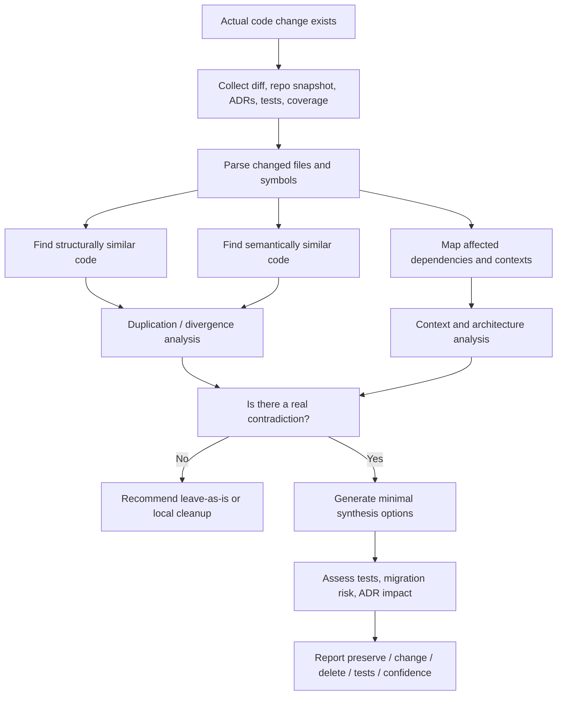
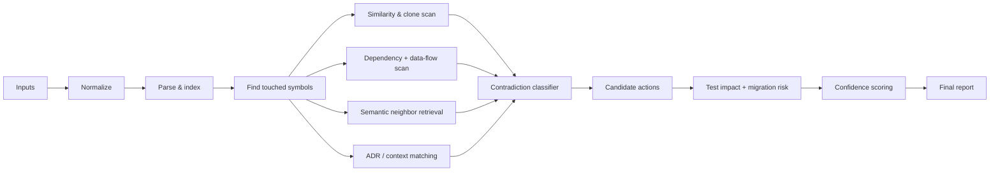

# Dialectical Refactor Reviewer

## Executive summary

This brief designs a Hegel-inspired AI skill for software implementation and review, not for abstract planning. Its job is to inspect *actual code changes* and ask whether new code merely adds another local patch or whether it exposes a deeper tension in the existing system: duplicated logic, overlapping responsibilities, brittle abstractions, conflicting domain models, architectural drift, or obsolete structure. Hegel is useful here because he treats development as an immanent process driven by internal tension, negation, mediation, and higher-order resolution. But Hegel is not sufficient by himself. A practical reviewer needs fallibilism, evidence, bounded contexts, behavior-preserving refactoring, test safety, technical-debt prioritization, and measurable architecture signals. That is why this design combines Hegel with pragmatism, Peircean abduction, Deweyan inquiry, Aristotelian practical judgment, Alexander’s coherence criterion, Fowler-style refactoring, DDD, Lehman’s software-evolution laws, ADRs, static analysis, AST differencing, semantic code search, dependency analysis, test impact analysis, and evolutionary-architecture fitness functions. citeturn28view5turn25view1turn25view2turn34view0turn25view4turn25view6turn21view3turn21view0turn21view2turn21view1turn38view0turn21view4turn21view6turn32view0turn21view11turn21view12turn31view1turn21view8turn21view14turn23view2

The central design recommendation is therefore straightforward: **treat “dialectic” as a disciplined review method for existing code under change, not as a vague philosophy generator and not as a reason to refactor everything.** The skill should be called when there is a diff, a staged change, a branch, a PR, or an edited working tree. It should compare the change against the codebase’s existing patterns and boundaries, classify whether a tension is real or superficial, recommend the smallest safe synthesis that improves coherence, and explicitly say when the right action is to leave the code alone. This recommendation is high-confidence. citeturn21view3turn31view6turn21view14turn21view15turn23view0turn23view2

Recommended confidence levels for this brief are:

| Recommendation | Confidence | Why |
|---|---:|---|
| Trigger the skill during coding, review, or PR analysis rather than pure planning | High | Refactoring is about improving an existing codebase, and test-impact methods require actual changes to analyze. citeturn21view3turn21view14turn21view15 |
| Use Hegel as a *diagnostic lens* rather than a universal method | High | Current scholarship rejects the crude thesis–antithesis–synthesis recipe and emphasizes immanent development instead. citeturn28view5turn39view0turn39view2turn6view0 |
| Require evidence from structure, semantics, tests, and architecture before recommending synthesis | High | Static analysis, AST differencing, code search, dependency analysis, and fitness functions provide complementary evidence. citeturn21view6turn32view0turn21view12turn31view1turn21view15turn23view2 |
| Default thresholds and scoring bands should be repo-specific and tunable | Medium | Coverage metrics, smells, and debt measures are useful, but they are not self-validating or universally meaningful as raw numbers. citeturn31view3turn21view8turn36view0 |

## Assumptions and design stance

This report assumes no fixed programming language, repository size, or CI product. It assumes that the skill may receive a patch or diff, a repository snapshot, optional ADRs, optional test/coverage artifacts, and optional historical metadata such as churn or ownership. If ADRs or coverage are missing, the skill should still run, but it should lower confidence and be more conservative about deletion and architectural recommendations. That stance follows DDD’s emphasis on bounded contexts and shared language, ADR practice’s emphasis on context and consequences, and CI / fitness-function practice’s emphasis on automatable feedback loops. citeturn24view0turn24view1turn21view4turn21view5turn31view6turn23view2

The stance of the reviewer should be **immanent, empirical, and minimal**. “Immanent” means it looks first for how the new change relates to the *existing* structure rather than inventing unrelated abstractions from outside. “Empirical” means every major recommendation should be treated as a revisable hypothesis supported by code evidence, test evidence, and architectural context rather than by philosophical rhetoric alone. “Minimal” means it prefers the smallest behavior-preserving change that resolves a real tension, because large premature abstractions can reduce flexibility rather than increase it. citeturn28view4turn34view0turn25view1turn31view5turn31view4

For this skill, a **real contradiction** in code is not mere difference. It is a case where two or more code paths, modules, abstractions, or domain terms appear to govern the *same responsibility* or invariant but do so with incompatible behaviors, data meanings, dependency directions, or change rules, such that future maintenance is likely to split again or fail unpredictably. A **superficial variation** is a bounded-context difference, performance specialization, compatibility adapter, platform-specific implementation, or test-only duplication whose reasons for change are distinct and documented. This distinction owes more to DDD, pragmatism, and architecture-smell research than to Hegel alone. citeturn24view0turn24view1turn25view1turn34view0turn33view0turn33view2

The workflow below reflects those assumptions: diff-first, evidence-first, synthesis-second. It is supported by refactoring practice, CI, DDD boundaries, test-impact analysis, and evolutionary-architecture feedback loops. citeturn21view3turn31view6turn24view0turn21view15turn23view2



## Hegelian foundations

The mapping below is the practical translation target for the reviewer. The detailed interpretations follow. The mapping itself is a design proposal; the philosophical background comes from the cited sources. citeturn28view5turn25view0turn28view2turn37view0turn39view2

| Hegelian idea | Reviewer question |
|---|---|
| Dialectic | Does the new change expose a deeper instability in the current design? |
| Contradiction | Are two parts of the system advancing incompatible claims about the same thing? |
| Negation | What should stop being the governing form here? |
| Determinate negation | What exactly is wrong with the old form, and what specifically replaces it? |
| Sublation | What should be cancelled, preserved, and lifted into a better arrangement? |
| Mediation | What relation, adapter, interface, or boundary makes the tension intelligible? |
| Concrete universality | Is there a general abstraction that still stays faithful to the real cases? |
| Development of a system | Is this codebase evolving coherently or just accreting patches? |
| Internal relations | Which other modules define the meaning of this change? |
| Totality | What broader subsystems, ADRs, and quality attributes are implicated? |
| Limits of thesis–antithesis–synthesis | Are we wrongly forcing a neat narrative onto uneven technical reality? |

### Dialectic

**Original Hegel idea.** Hegel describes logic as having three “moments”: the fixed determination of understanding, the dialectical or negatively rational moment in which one-sidedness destabilizes that determination, and the speculative moment in which the opposition is grasped in a higher unity. Crucially, this movement is supposed to be *immanent*: “nothing extraneous is introduced”; the content moves by its own inner instability. citeturn28view5turn28view4

**Current interpretation, improvement, criticism.** Current scholarship generally rejects the classroom myth that Hegel gives a universal recipe of thesis–antithesis–synthesis. The stronger reading is that dialectic is an account of self-developing conceptual insufficiency, not a reusable three-box algorithm. A common misunderstanding for software is to turn “dialectic” into “find any opposition, then invent a synthesis.” That is too external, too formal, and not Hegelian enough. citeturn39view0turn39view2turn6view0

**Practical role in the skill.** “Dialectic” should mean: start from the existing code, ask where the new change reveals one-sidedness or instability, and look for a more coherent arrangement that grows from that evidence. The skill should never force a synthesis just because two things look different. Its first obligation is to decide whether anything genuinely unstable has been exposed at all. Usefulness: high. Risk: medium if turned into abstraction theater. citeturn28view4turn21view3turn31view5

### Contradiction

**Original Hegel idea.** Hegel gives contradiction a central role, but not as a celebration of unresolved logical incoherence. On standard scholarly readings, contradiction marks a determination whose one-sidedness breaks down and drives transition; it is a sign that the current form cannot fully sustain itself. Unresolved contradiction is not the goal. citeturn28view5turn25view0

**Current interpretation, improvement, criticism.** A common misunderstanding is that Hegel licenses “A and not-A” anywhere. The more careful interpretation is that Hegel does not simply reject the law of non-contradiction; rather, contradiction names a structurally unstable relation whose inadequacy must be overcome. Adorno later radicalizes this by using contradiction as a way to expose false identity and suppressed difference, which is useful as a caution against premature closure. citeturn25view0turn29view0

**Practical role in the skill.** In code review, contradiction should be reserved for conflicts such as: two validation pipelines for the same domain rule with different invariants; two modules serializing the same concept differently; a public interface claiming one lifecycle while callers assume another; an abstraction whose parameters and conditionals now negate its original purpose. Usefulness: high. Risk: high if “contradiction” is applied to every stylistic or contextual difference. citeturn24view0turn31view4turn33view1

### Negation

**Original Hegel idea.** Negation in Hegel is not mere deletion. The dialectical moment reveals the insufficiency of a determination by showing how, through its own restrictedness, it passes into its opposite or breaks down. Negation is therefore productive: it exposes what a form excludes and why that exclusion fails. citeturn28view5

**Current interpretation, improvement, criticism.** Modern readings typically understand negation as an engine of conceptual revision, not as rhetorical hostility or permanent destruction. A software misunderstanding would be to equate “negation” with “delete the old code.” In practice, many bad refactors delete knowledge that still needs preservation in tests, adapters, or transition layers. citeturn28view5turn21view3

**Practical role in the skill.** The reviewer should ask: what formerly central code path or assumption should *stop governing* this part of the system? Examples include an obsolete branching strategy, a repository abstraction that no longer models the domain, or a duplicate helper that should no longer attract new call sites. Usefulness: medium-high. Risk: medium if confused with aggressive cleanup without migration discipline. citeturn21view3turn31view6

### Determinate negation

**Original Hegel idea.** Hegel insists that the result of dialectical breakdown is not empty nothingness but a **determinate negation**: the negation of *this* inadequate form for *specific* reasons, yielding a new form with content. The result has a history and a shape because it emerges from the concrete weakness of what came before. citeturn28view5

**Current interpretation, improvement, criticism.** Determinate negation is one of the most useful Hegelian ideas for software because it blocks vague “improvement” talk. Adorno extends the idea in a critical direction: determinate negation should identify the specific mismatch between concept and object rather than dissolve everything into a happy synthesis. The misunderstanding to avoid is “refactor because it feels cleaner.” citeturn28view5turn29view0

**Practical role in the skill.** Every recommendation should answer: *what exactly is being negated, and why?* For example: “Negate `LegacyPricingService` as the central pricing entrypoint because changed code now duplicates discount-order logic already housed in `PricingPolicy`; preserve existing public response shape through an adapter; move invariants into one shared policy object.” Usefulness: very high. Risk: low if enforced as a reporting requirement. citeturn31view4turn21view3

### Sublation and Aufhebung

**Original Hegel idea.** Aufhebung has the famous double meaning Hegel exploits: to cancel and to preserve at once. Later determinations do not simply erase earlier ones; they preserve what remains valid while transforming the whole relation. citeturn28view5turn28view4

**Current interpretation, improvement, criticism.** Scholars widely treat sublation as one reason the simplistic “replace old with new” model misses Hegel. In technical work, the main misunderstanding is to think synthesis means merging all code into one abstraction. Often the correct “sublation” is narrower: keep an old boundary but change its implementation, preserve an interface while deprecating call paths, or retain a specialized variant while extracting only the common invariant. citeturn28view5turn39view2

**Practical role in the skill.** The reviewer’s refactor options should explicitly separate three kinds of action: **preserve**, **transform**, **delete**. That makes sublation operational. For every major recommendation, the report should say what valuable behavior or domain language must survive, what localized structure should change, and what can safely disappear. Usefulness: very high. Risk: low if kept concrete. citeturn21view3turn24view1

### Mediation

**Original Hegel idea.** Hegel’s logic treats opposed terms as intelligible through relations that mediate them. His account of judgment and syllogism emphasizes that subject and predicate, universality and particularity, are not self-sufficient atoms but gain intelligibility through structured relations and wholes. citeturn37view4turn28view1

**Current interpretation, improvement, criticism.** A modern improvement is to read mediation less metaphysically and more inferentially or structurally: what intermediate concept, relation, or practice makes two sides fit together? The misunderstanding to avoid is mystical “mediation” language with no concrete design proposal. In software, mediation must cash out as an adapter, boundary, anti-corruption layer, interface, translation object, policy object, or test seam. citeturn37view4turn24view0turn24view1

**Practical role in the skill.** When the reviewer finds incompatible modules solving the same problem in different ways, it should ask whether the right move is merge-or-delete or whether a mediator is required: a translator between bounded contexts, a compatibility façade, or a single policy engine underlying multiple ports. Usefulness: high. Risk: medium if it becomes an excuse for extra layers. citeturn24view0turn21view5

### Concrete universality

**Original Hegel idea.** Hegel contrasts abstract universality with forms of universality that remain bound to their particularization and individuality. In later logical and social readings, the movement from universality to particularity to individuality is what makes a universal “concrete” rather than empty. citeturn28view2turn37view2

**Current interpretation, improvement, criticism.** For software, this is a powerful corrective to bad abstraction. An abstraction is good only if it genuinely organizes the concrete cases without erasing the very distinctions that make them meaningful. A common misunderstanding is to treat every repetition as evidence for a universal type or helper. Sandi Metz’s warning about the “wrong abstraction” is exactly relevant here: if the shared form survives only by accumulating flags and branches, the supposed universal is abstract in the bad sense. citeturn31view4turn31view5

**Practical role in the skill.** A proposed abstraction should count as “concrete” only if it preserves case-meaning while simplifying maintenance. Heuristically: shared inputs and outputs are not enough; the reviewer should look for shared responsibility, shared invariants, shared reasons-to-change, and stable naming. Usefulness: very high. Risk: high if ignored. citeturn24view1turn31view4

### Development of a system

**Original Hegel idea.** Hegel is one of philosophy’s great system-thinkers. He aimed at a comprehensive systematic philosophy whose parts develop from a logical starting point rather than remain disconnected fragments. Development here is not arbitrary accumulation but structured unfolding. citeturn37view0turn37view3

**Current interpretation, improvement, criticism.** Modern criticism pushes hard against any naive historicism or inevitabilism. Popper’s critique of historicism is especially relevant: one should not assume that history unfolds by knowable laws toward a determinate end. Dewey likewise replaces grand teleology with experimental revision in light of consequences. In code, that means “evolution” should not be narrated as inevitable progress after the fact. citeturn30search0turn34view0

**Practical role in the skill.** The reviewer should track system development as *observed evolution under constraints*: churn, smells, debt, repeated policy forks, and boundary instability. It should not claim the codebase is “historically destined” for microservices, event sourcing, or any other target architecture. Usefulness: high. Risk: high if teleology replaces evidence. citeturn38view0turn38view4turn23view2

### Internal relations

**Original Hegel idea.** Hegel’s thought is holistic in the sense that categories such as universality, particularity, and singularity are not adequately understood in isolation but only through their interrelations. The meaning of a part depends on the relations that constitute the whole. citeturn37view2

**Current interpretation, improvement, criticism.** In software, this is improved by dependency analysis, bounded contexts, and interface contracts. The misunderstanding to avoid is total fusion: not every dependency proves deep internal relation. DDD explicitly warns that models must have boundaries; otherwise contexts bleed into one another and changes become unintelligible. citeturn24view0turn24view1

**Practical role in the skill.** Every review should ask not only “what changed?” but also “which callers, callees, data shapes, contexts, and ADRs give this change its meaning?” That is why the skill should include call graphs, import graphs, fan-in / fan-out, public API usage, and semantic neighbors before it recommends abstraction or deletion. Usefulness: very high. Risk: medium if treated as a reason for whole-repo rewrites. citeturn31view1turn21view6

### Totality

**Original Hegel idea.** Hegel’s system constantly relates local determinations to a larger whole. The whole is not just a bag of pieces; it is the relation in which parts acquire intelligibility. citeturn37view0turn37view2

**Current interpretation, improvement, criticism.** Popper’s anti-holist warning matters here. It is a mistake to think one must comprehend or rewrite “the totality” before making a local improvement. Alexander’s later insistence on coherence provides a better practical correction: the relevant whole is the smallest system in which local changes must still produce a coherent result. citeturn30search0turn25view6

**Practical role in the skill.** The reviewer should inspect the *relevant totality*: affected module, neighboring dependencies, affected context, quality attributes, ADRs, and tests. It should not demand global optimization. Usefulness: high. Risk: high if it drives elegant but destabilizing “whole-system” refactors. citeturn21view4turn23view2turn31view6

### The limits of thesis–antithesis–synthesis

**Original Hegel idea.** Hegel did not present his method as a universal thesis–antithesis–synthesis machine. He criticized externally imposed triplicity as a “lifeless schema,” and modern scholarship stresses that many developments in the *Logic* do not fit the neat textbook form. Muller’s classic article shows how powerful the legend became despite its poor textual basis. citeturn39view2turn39view0turn6view0

**Current interpretation, improvement, criticism.** The useful correction is simple: keep the ideas of internal tension, determinate negation, mediation, and preservation, but abandon the expectation that every review will produce three tidy stages. Software development is irregular; some cases end in deletion, some in extraction, some in an adapter, some in “leave as is.” citeturn39view0turn39view1

**Practical role in the skill.** The skill should *never* emit “thesis / antithesis / synthesis” labels. Its output should use engineering language: changed behavior, duplicated logic, context bleed, split invariant, migration path, test impact, and confidence. Usefulness of the simplified formula: low. Risk: very high. citeturn39view2turn21view3

## Modern correctives and challenges

Hegel gives the skill a style of diagnosis, but these modern theories and tools make it implementable. The table below is ordered by what each item solves beyond Hegel, how it relates to Hegel, and how it should shape the skill design. The confidence ratings here are design judgments based on the source base. citeturn25view1turn25view2turn34view0turn25view4turn25view6turn21view3turn21view0turn21view2turn21view1turn38view0turn21view4turn21view6turn32view0turn21view11turn21view12turn31view1turn21view15turn23view2

### Philosophical and design-method correctives

| Corrective | What problem it solves beyond Hegel | Supports / modifies / contradicts Hegel | Effect on skill design | Confidence |
|---|---|---|---|---:|
| Pragmatism | Prevents conceptual reconciliation from being treated as self-justifying; introduces fallibilism and the primacy of practice | Modifies Hegel: keep development-through-tension, reject closed system confidence | Treat recommendations as provisional hypotheses; require observable consequences and revision pathways | High citeturn25view1 |
| Peirce and abduction | Gives a logic for generating explanatory hypotheses from surprising facts | Supports Hegel’s interest in development, but replaces inevitability with conjecture-and-test | Model “possible missing abstraction” as an abductive hypothesis, not a deduction | High citeturn25view2turn35view0 |
| Dewey and inquiry | Replaces abstract teleology with experimental problem-solving guided by consequences | Corrects Hegel’s risk of grand closure | Every “synthesis” must be framed as “try this because it better solves the current problematic situation with acceptable side effects” | High citeturn34view0 |
| Aristotle and practical judgment | Adds case-sensitive judgment where no algorithm can decide perfectly | Corrects any mechanistic use of dialectic | Keep a human-in-the-loop for public API changes, removals, and cross-context merges | High citeturn25view4 |
| Christopher Alexander’s pattern language | Gives a test for whether a set of local design moves generates a coherent whole | Supports Hegel’s concern for wholes, but with a concrete coherence criterion | Ask whether the proposed refactor generates a more coherent code structure, not only less duplication | High citeturn25view6turn25view5 |
| Martin Fowler’s refactoring principles | Supplies disciplined, behavior-preserving transformation and risk reduction | Strongly improves Hegel by operationalizing safe local change | Prefer small preparatory refactors, not sweeping conceptual rewrites | High citeturn21view3 |
| Code smells | Turns vague “tension” into recognizable surface indicators of deeper design trouble | Supports the reviewer as a diagnostic sensor, not a philosopher-oracle | Use smell detectors as weak signals that must be corroborated by context and tests | High citeturn21view0 |
| Design smells | Extends smell analysis beyond code syntax to abstraction, modularization, and hierarchy problems | Improves Hegel by making abstraction pathologies operational | Flag duplicate abstraction, missing abstraction, broken modularization, and hierarchy distortion | High citeturn33view2turn33view1 |
| DDD | Distinguishes true contradiction from legitimate variation across bounded contexts | Corrects Hegelian over-totalization | Never merge across contexts merely because words or structures look similar; use ubiquitous language and context maps | High citeturn21view2turn24view0turn24view1 |
| Technical debt theory | Adds prioritization and economic communication | Modifies Hegel by introducing cost, interest, and payoff rather than just conceptual resolution | Include debt type, interest, and prudence in the report; not every flaw should be paid down now | High citeturn21view1turn36view0 |
| Lehman’s laws | Frames software as continuously changing, complexity-increasing, feedback-driven evolution | Strongly supports the “development of a system” idea, but empirically and non-metaphysically | Track change frequency, complexity growth, and recurring tension areas over time | High citeturn38view0turn38view4 |
| ADRs | Preserve design context and consequences that pure code analysis misses | Improves Hegel by externalizing mediation and architectural reasons | Match changed files against ADR topics; lower confidence when proposals conflict with accepted ADRs | High citeturn21view4turn21view5 |

### Engineering and analysis-method correctives

| Technique | What problem it solves beyond Hegel | Supports / modifies / contradicts Hegel | Effect on skill design | Confidence |
|---|---|---|---|---:|
| Static analysis | Provides measurable evidence about flows, complexity, unused code, and style / safety issues | Supports Hegelian “internal relations” with actual analyzable structure | Use as baseline evidence; never rely on LLM intuition alone | High citeturn21view6turn31view7 |
| AST comparison | Distinguishes semantic-preserving structural moves from text edits and detects move / rename structure | Strong support: lets “determinate negation” target actual structural change | Use AST diff to detect clones, refactorings, move-heavy edits, and abstraction drift | High citeturn32view0turn21view9turn22view0 |
| Semantic code search | Finds conceptually related code even when names differ | Modifies Hegel by improving practical recollection of the whole system | Search for “same job, different words” to detect hidden duplication and divergent implementation | High citeturn21view11turn21view12 |
| Dependency analysis | Shows whether a local change actually has system-wide implications | Supports internal-relations / totality, but at a bounded, actionable scale | Build call graphs, import graphs, fan-in / fan-out, data-flow slices | High citeturn31view1turn21view7turn21view6 |
| Test coverage analysis | Shows what changed code is or is not exercised, but also warns against fetishizing a single number | Corrects both Hegelian abstraction and naive metricism | Use coverage as risk evidence, not as truth; combine with changed-line impact and behavior expectations | High citeturn21view8turn31view3 |
| Test impact analysis | Narrows required testing to what a change actually affects | Strong practical improvement on generic “mediation” | Map changed code to relevant tests and require characterization tests before risky deletions | High citeturn21view14turn21view15 |
| Evolutionary architecture and fitness functions | Makes architecture conformance measurable over time | Strong practical extension of “system development” | Turn architectural rules into automatable gates and feedback functions | High citeturn21view13turn23view0turn23view2 |

## Risks and guardrails

The reviewer must be explicitly anti-naive. The main danger is not “insufficient philosophy” but *misapplied philosophy plus overconfident automation*. The following guardrails are therefore design requirements, not optional niceties. citeturn30search0turn34view0turn31view4turn31view5turn31view3turn24view0turn31view6

| Risk | Philosophical or technical problem | Why it matters in code review | Guardrail in the skill |
|---|---|---|---|
| Seeing contradiction where there is only legitimate variation | Not every difference is opposition; DDD shows many valid context-specific variations | False positives lead to destructive normalization | Require shared responsibility + overlapping invariants + shared change pressure before labeling “contradiction” citeturn24view0turn24view1 |
| Forcing every difference into dialectical conflict | Treating Hegel as a universal recipe repeats the “lifeless schema” error | Review output becomes theatrical and unhelpful | Ban thesis/antithesis/synthesis language in reports; require engineering wording only citeturn39view2turn39view0 |
| Treating history as inevitable progress | Popper’s historicism warning applies directly | Encourages post-hoc “the codebase was destined for X” narratives | Phrase all structural proposals as hypotheses under current evidence, not destiny citeturn30search0turn34view0 |
| Post-hoc rationalization | Easy to invent a neat story after a refactor has already been chosen | Produces confidence theater rather than explanation | Require explicit evidence blocks: diff, duplicate match, dependency impact, tests, ADR fit |
| Excessive abstraction | Abstract universals often erase the distinctions that matter | Wrong abstractions increase conditionals, flags, and coupling | Penalize abstractions that need many mode flags, branches, or special-case parameters citeturn31view4turn31view5 |
| Refactoring too early | You may not yet know the stable pattern | Early extraction can lock the code into the wrong shape | Prefer the rule of “observe at least repeated or recurring pressure” before deep extraction; allow temporary duplication with explanation citeturn31view4turn36view0 |
| Creating abstractions more complex than duplication | The supposed synthesis may cost more than local repetition | Developers inherit a worse system under the banner of cleanliness | Report “over-abstraction risk” whenever proposed unification crosses contexts or increases configurability sharply citeturn31view4turn24view0 |
| Breaking local clarity for global elegance | Reader empathy and intention can matter more than maximal deduplication | Reviewers often optimize topology while degrading readability | Reward intention-revealing names and local comprehensibility; do not merge if semantics become harder to inspect citeturn31view5 |
| Treating every inconsistency as a problem | Some duplication is deliberate for reliability, performance, containment, or migration | “Cleanup” can remove useful redundancy | Require the report to classify inconsistency as harmful, useful, transitional, or unknown |
| Ignoring delivery constraints and test safety | Refactoring without CI, tests, or rollback violates safe-change discipline | Can break behavior and slow delivery | Require characterization tests for risky legacy changes; require rollback or adapter plans for public-contract changes citeturn21view3turn31view6turn21view14 |
| Using coverage as a truth metric | Coverage finds blind spots but does not measure test quality directly | High coverage can coexist with poor tests | Use coverage only as one signal; combine with changed-line relevance and behavior assertions citeturn31view3turn21view8 |
| Ignoring architecture context | Local code can look duplicative while reflecting ADR-backed decisions | Naive merging can violate accepted architecture | Scan ADRs and context maps before recommending cross-module synthesis citeturn21view4turn21view5turn24view0 |

## Skill behavior, workflow, and algorithms

### Trigger conditions and when to run

The skill should be called **while coding or reviewing code**, not during pure planning and not before any actual implementation artifact exists. Good triggers are: editor save with modified file, staged diff, local branch commit, pull request update, or post-merge drift scan. That recommendation follows directly from refactoring’s focus on existing code, CI’s fast-feedback loop, and test-impact analysis’s dependence on changed code. citeturn21view3turn31view6turn21view14turn21view15

Recommended run modes:

| Mode | Trigger | Scope | Output | Gate? |
|---|---|---|---|---|
| Editor advisory | File save / staged hunk | Changed file + nearest symbols | Quick contradiction / duplication hints | No |
| Pre-commit advisory | Local commit with non-trivial diff | Changed files + semantic neighbors | Suggested tests and local refactors | No |
| PR review | Pull request or merge request | Full diff + repo context + ADRs + tests | Full report | Optional |
| CI gate | Only for risky or protected areas | Full analysis + safety checks | Pass / warn / block | Yes, conservatively |
| Nightly evolution scan | Scheduled | Whole repo trends | Drift / debt trend report | No |

### Step-by-step workflow

The workflow below combines Hegelian diagnosis with practical evidence sources such as AST differencing, call-graph analysis, code search, ADRs, and changed-line test selection. citeturn32view0turn31view1turn21view11turn21view15turn21view4



The operational steps should be:

1. **Collect inputs.** Ingest base commit, head commit, unified diff, touched files, repository snapshot, optional ADRs, optional test and coverage reports, and optional metadata such as churn or protected paths.

2. **Normalize and parse.** Build syntax trees for changed files; identify changed symbols, method signatures, exported types, config keys, and schema artifacts. Use language-native parsers where available; use fallback text heuristics only when parsing fails. citeturn22view0turn21view6

3. **Recover structural intent from the diff.** Run AST differencing rather than raw text diff alone so moved, renamed, extracted, or inlined code is not misread as totally new behavior. citeturn32view0turn21view9

4. **Retrieve potential ancestors and rivals.** Use both lexical and semantic search to find older code that appears to do the same job, even if names differ. Seed queries from changed identifiers, docstrings, comments, domain nouns, ADR titles, and changed tests. citeturn21view11turn21view12

5. **Map internal relations.** Build call graphs, import graphs, fan-in / fan-out summaries, data-flow slices, and package or module dependency maps for touched symbols. citeturn31view1turn21view7turn21view6

6. **Classify duplication and divergence.** Distinguish exact duplication, near-duplicate with local variation, parallel implementations in separate contexts, and incompatible policies solving the same domain problem.

7. **Check architectural context.** Inspect accepted ADRs, bounded-context hints, directory boundaries, and architecture fitness rules to see whether the change respects existing system constraints. citeturn21view4turn21view5turn24view0turn23view2

8. **Assess test impact and safety.** Identify directly impacted tests, changed-line coverage, missing characterization tests, and high-risk low-coverage areas. citeturn21view15turn31view3turn21view8

9. **Generate candidate actions.** For each real tension, produce a ranked set drawn only from: merge, extract, rename, inline, split, move, wrap with adapter, deprecate, delete, or leave-as-is.

10. **Score confidence and emit report.** Confidence should depend on multi-signal agreement, not on one strong smell or one strong embedding hit.

### Prioritized checklist for deciding real contradiction versus mere variation

This checklist is the reviewer’s most important operating heuristic. Items are ordered from strongest evidence to weakest. The first four should dominate the decision. That priority reflects DDD, refactoring practice, wrong-abstraction experience, and architecture-smell evidence. citeturn24view0turn21view3turn31view4turn33view0

1. **Same responsibility?** Do the changed code and existing code answer the same business question or enforce the same invariant?
2. **Same bounded context?** If not, default to “variation,” not “contradiction,” unless ADRs explicitly require unification.
3. **Same reasons to change?** If two code paths change together across commits or would need simultaneous edits for the next feature, contradiction likelihood rises.
4. **Behavioral conflict?** Do the paths produce incompatible outputs, error modes, ordering rules, or lifecycle assumptions for equivalent inputs?
5. **Structural overlap?** Are AST shapes or token sequences highly similar in semantically relevant regions?
6. **Dependency overlap?** Do they call the same collaborators, touch the same schemas, or sit on the same flow path?
7. **Naming and language overlap?** Do symbols and comments use the same domain vocabulary?
8. **ADR conflict or absence?** If accepted decisions explain the split, reduce contradiction confidence; if the change silently violates an ADR, raise it.
9. **Test evidence.** Do tests already distinguish the variants for valid reasons, or do they reveal untested divergence?
10. **Over-abstraction risk.** If a proposed synthesis requires many flags, conditionals, or public-surface changes, prefer leave-as-is or narrower extraction.

A useful forcing question for the model is: **“If this code changes again next week, will the team reliably know one place to edit or several?”** If the honest answer is “several, and that seems accidental,” contradiction confidence should rise.

### Concrete algorithmic approaches by analysis stage

| Stage | Goal | Recommended approach | Notes |
|---|---|---|---|
| Diff normalization | Recover changed symbols and edit types | Parse unified diff; map hunks to files, classes, functions, exports | Essential for all later stages |
| AST differencing | Detect moves, renames, extraction, inline-like edits | Use syntax-aware differencing; store edit actions per node | GumTree-style diffs are specifically useful because they align edits to syntax and detect moved / renamed elements. citeturn32view0turn21view9 |
| Parse and incremental indexing | Maintain cheap editor-time analysis | Use Tree-sitter or language-native parsers | Incremental parsing is fast enough for editor workflows. citeturn22view0 |
| Structural duplication | Find near-clones and repeated control/data structure | Token shingles + AST subtree similarity + normalized pretty-print hashes | Use token similarity as cheap prefilter; AST similarity for precision |
| Semantic duplication | Find “same idea, different words” | Hybrid retrieval: BM25 / trigram + embedding search over code chunks and docstrings | Code-search benchmarks and code-language models support this pattern. citeturn21view11turn21view12 |
| Dependency impact | Measure internal relations and blast radius | Call graph, import graph, fan-in / fan-out, package cycle detection, data-flow slices | Static analyzers and queryable code graphs provide the foundations. citeturn21view6turn31view1turn21view7 |
| Design / architecture smells | Turn “tension” into recognized pathologies | Rule-based smell detectors plus architecture-smell inventory | Good for weak evidence; do not use as sole justification. citeturn21view0turn33view0turn33view2 |
| Context / ADR matching | Distinguish legitimate divergence from accidental duplication | Parse `docs/adr`, map titles / tags / consequences to changed files and domains | Accepted ADRs should lower “merge” pressure when they explain the split. citeturn21view4turn21view5 |
| Test impact | Recommend minimum safe test set | Changed-line coverage map + call graph + prior test-to-file mapping | This is the right basis for “tests to add or update.” citeturn21view14turn21view15turn21view8 |
| Confidence scoring | Avoid one-signal overconfidence | Weighted multi-signal score with downgrade rules | Proposed below |
| Final report synthesis | Convert evidence into action | Low-temperature LLM over structured evidence only | The model should not inspect raw repo text at this stage if structured evidence exists |

### Recommended confidence scoring heuristic

I recommend the following starting heuristic, with **medium confidence** because thresholds always need repository tuning.

**Evidence weights**

- Structural similarity / clone evidence: 0.20
- Semantic similarity / same-responsibility evidence: 0.20
- Shared dependencies / data flow / same schema: 0.15
- Shared bounded context / same domain language: 0.15
- Behavioral divergence evidence from tests or logic: 0.15
- ADR support or ADR violation signal: 0.10
- Churn / historical co-change or repeated smell pressure: 0.05

**Downgrade rules**

- Subtract 0.15 if code spans different bounded contexts.
- Subtract 0.15 if proposed synthesis requires more than three mode flags or conditionals.
- Subtract 0.10 if coverage is missing and no characterization tests exist.
- Subtract 0.10 if code is generated, vendored, or compatibility-only.

**Bands**

- **High confidence:** score ≥ 0.75 and at least four independent signals agree.
- **Medium confidence:** 0.55–0.74 or three signals agree but risk is moderate.
- **Low confidence:** < 0.55, missing tests / ADRs, or strong cross-context ambiguity.

### Suggested metrics and thresholds

These are **recommended defaults**, not universal truths. Use them as initial settings and tune with false-positive and false-negative feedback. Coverage thresholds especially should be treated as advisory, because coverage numbers alone are not a measure of test quality. citeturn31view3turn21view8

| Metric | Starting threshold | Interpretation | Tuning advice |
|---|---:|---|---|
| Token similarity | 0.85 | Strong near-clone suspicion | Lower for boilerplate-heavy languages |
| AST subtree similarity | 0.80 | Strong structural duplication | Raise if parser noise is high |
| Semantic similarity | top-3 hit + cosine ≥ 0.82 | Same-responsibility candidate | Validate against context words |
| Shared changed-line coverage | < 0.70 | Risk band increase | Treat as stronger for core-domain code |
| Fan-in | top 10% of repo | High blast radius | Raise migration risk and test requirements |
| Public API touched | boolean | High migration sensitivity | Require adapter / deprecation plan |
| Persistence schema touched | boolean | High migration sensitivity | Require migration and rollback sections |
| Mode flags added to fit abstraction | > 3 | Over-abstraction suspicion | Keep threshold low; this is a strong smell |
| Cross-context unification | boolean | Default caution | Only allow with strong ADR / domain evidence |
| Candidate delete but runtime or test references remain | any | Block delete recommendation | Require deprecation instead |

### Migration and safety procedures

The skill should not merely propose a refactor; it should propose a **safe path**. Refactoring literature, CI practice, TIA, and fitness-function thinking all point toward small, reversible, testable steps with explicit feedback. citeturn21view3turn31view6turn21view15turn23view2

Required safety procedure for non-trivial recommendations:

1. **Characterize current behavior** before moving or deleting logic in poorly understood areas.
2. **Separate preparatory refactoring from functional change** whenever possible.
3. **Preserve public contracts** with adapters, facades, or deprecation layers before removal.
4. **Update or add tests** at the unit level for invariants and at the integration level for boundary behavior.
5. **Attach migration notes** for public APIs, schema changes, or cross-context behavior.
6. **Produce rollback guidance**: the old path to restore, the revert commit strategy, or the temporary compatibility layer.
7. **Update ADRs** whenever the refactor changes an architecturally significant decision or quality-attribute tradeoff. citeturn21view4turn21view5

### Developer guidance for CI and editor integration

The reviewer should be helpful in the editor and conservative in CI. Continuous integration exists to give fast feedback on real changes; evolutionary-architecture fitness functions exist to automate architectural conformance; neither implies that every advisory finding should block delivery. citeturn31view6turn23view2

Recommended policy:

| Integration point | Run level | Human in loop? | Gate rule |
|---|---|---|---|
| Editor | Lightweight, incremental | Optional | Never gate |
| Pre-commit | Lightweight + local tests | Optional | Never gate |
| PR comment | Full analysis | Yes | Advisory by default |
| Protected-branch CI | Full analysis + safety checks | Yes | Gate only on high-confidence risky findings |
| Nightly architecture scan | Trend analysis | Yes | No gate |

**Recommended gating rules**

Block only when all three are true:

1. The reviewer reports **high-confidence** contradiction / drift / unsafe deletion.
2. The affected area is **risk-sensitive**: public API, persistence, security, concurrency, or high fan-in.
3. There is **insufficient safety evidence**: missing impacted tests, no rollback, or ADR violation.

That keeps the skill from becoming a style police bot.

## Scaffolding file and implementation templates

What follows is a practical repo-ready scaffold. The surrounding structure is grounded in diff-driven refactoring, bounded-context checks, ADR review, static analysis, and targeted testing. citeturn21view3turn24view0turn21view4turn21view6turn21view15

### Recommended repo scaffold

```text
dialectical-refactor-reviewer/
├─ docs/
│  └─ dialectical-refactor-reviewer.md
├─ config/
│  ├─ rules.yaml
│  ├─ thresholds.yaml
│  └─ contexts.yaml
├─ schemas/
│  ├─ reviewer_input.schema.json
│  └─ reviewer_output.schema.json
├─ prompts/
│  ├─ stage_1_change_summary.md
│  ├─ stage_2_contradiction_classifier.md
│  ├─ stage_3_synthesis_recommender.md
│  └─ stage_4_report_writer.md
├─ scripts/
│  ├─ collect_inputs.py
│  ├─ parse_repo.py
│  ├─ ast_diff.py
│  ├─ semantic_search.py
│  ├─ dependency_impact.py
│  ├─ adr_match.py
│  ├─ test_impact.py
│  ├─ score_report.py
│  └─ render_report.py
└─ cli/
   └─ reviewer.py
```

### Recommended markdown output template

This is the human-facing report the skill should produce after analysis.

```markdown
# Dialectical Refactor Reviewer Report

## Change summary
## Existing system affected
## Tension or contradiction found
## Evidence
## Duplication or divergence analysis
## Proposed synthesis
## Refactor recommendation
## Code to preserve
## Code to change
## Code to delete
## Tests to add or update
## Migration risk
## Over-abstraction risk
## Confidence level
## When not to refactor
```

### Input JSON schema

The input schema below assumes a diff-first workflow, optional ADRs, and optional test / coverage evidence. That structure is the most practical expression of the evidence base above. citeturn21view4turn21view15turn21view8

```json
{
  "$schema": "https://json-schema.org/draft/2020-12/schema",
  "title": "DialecticalRefactorReviewerInput",
  "type": "object",
  "required": ["repo", "change"],
  "properties": {
    "repo": {
      "type": "object",
      "required": ["root", "base_commit", "head_commit"],
      "properties": {
        "root": { "type": "string" },
        "base_commit": { "type": "string" },
        "head_commit": { "type": "string" },
        "languages": {
          "type": "array",
          "items": { "type": "string" }
        },
        "protected_paths": {
          "type": "array",
          "items": { "type": "string" }
        }
      }
    },
    "change": {
      "type": "object",
      "required": ["unified_diff", "changed_files"],
      "properties": {
        "unified_diff": { "type": "string" },
        "changed_files": {
          "type": "array",
          "items": {
            "type": "object",
            "required": ["path", "change_type"],
            "properties": {
              "path": { "type": "string" },
              "change_type": {
                "type": "string",
                "enum": ["added", "modified", "deleted", "renamed", "copied"]
              }
            }
          }
        },
        "changed_symbols": {
          "type": "array",
          "items": { "type": "string" }
        }
      }
    },
    "architecture": {
      "type": "object",
      "properties": {
        "adrs": {
          "type": "array",
          "items": {
            "type": "object",
            "required": ["id", "title", "status", "path"],
            "properties": {
              "id": { "type": "string" },
              "title": { "type": "string" },
              "status": { "type": "string" },
              "path": { "type": "string" },
              "summary": { "type": "string" },
              "tags": {
                "type": "array",
                "items": { "type": "string" }
              }
            }
          }
        },
        "bounded_contexts": {
          "type": "array",
          "items": {
            "type": "object",
            "required": ["name", "paths"],
            "properties": {
              "name": { "type": "string" },
              "paths": {
                "type": "array",
                "items": { "type": "string" }
              },
              "shared_language_terms": {
                "type": "array",
                "items": { "type": "string" }
              }
            }
          }
        }
      }
    },
    "tests": {
      "type": "object",
      "properties": {
        "coverage_summary": {
          "type": "object",
          "properties": {
            "line_coverage": { "type": "number" },
            "branch_coverage": { "type": "number" },
            "changed_line_coverage": { "type": "number" }
          }
        },
        "test_to_file_map": {
          "type": "array",
          "items": {
            "type": "object",
            "required": ["test", "files"],
            "properties": {
              "test": { "type": "string" },
              "files": {
                "type": "array",
                "items": { "type": "string" }
              }
            }
          }
        }
      }
    },
    "history": {
      "type": "object",
      "properties": {
        "file_churn": {
          "type": "array",
          "items": {
            "type": "object",
            "required": ["path", "commits_last_90d"],
            "properties": {
              "path": { "type": "string" },
              "commits_last_90d": { "type": "integer" }
            }
          }
        }
      }
    }
  }
}
```

### Output JSON schema

The output schema below mirrors the report format and the practical questions the user specified.

```json
{
  "$schema": "https://json-schema.org/draft/2020-12/schema",
  "title": "DialecticalRefactorReviewerOutput",
  "type": "object",
  "required": [
    "change_summary",
    "affected_system",
    "findings",
    "recommendation",
    "tests",
    "risks",
    "confidence"
  ],
  "properties": {
    "change_summary": {
      "type": "object",
      "properties": {
        "what_changed": { "type": "string" },
        "new_symbols": {
          "type": "array",
          "items": { "type": "string" }
        },
        "changed_symbols": {
          "type": "array",
          "items": { "type": "string" }
        }
      }
    },
    "affected_system": {
      "type": "object",
      "properties": {
        "contexts": {
          "type": "array",
          "items": { "type": "string" }
        },
        "modules": {
          "type": "array",
          "items": { "type": "string" }
        },
        "adrs": {
          "type": "array",
          "items": { "type": "string" }
        }
      }
    },
    "findings": {
      "type": "array",
      "items": {
        "type": "object",
        "required": ["kind", "summary", "evidence", "is_real_contradiction"],
        "properties": {
          "kind": {
            "type": "string",
            "enum": [
              "duplication",
              "divergence",
              "wrong_abstraction",
              "narrow_abstraction",
              "architecture_smell",
              "obsolete_pattern",
              "adr_conflict",
              "test_gap"
            ]
          },
          "summary": { "type": "string" },
          "evidence": {
            "type": "array",
            "items": { "type": "string" }
          },
          "is_real_contradiction": { "type": "boolean" },
          "preserve": {
            "type": "array",
            "items": { "type": "string" }
          },
          "change": {
            "type": "array",
            "items": { "type": "string" }
          },
          "delete": {
            "type": "array",
            "items": { "type": "string" }
          }
        }
      }
    },
    "recommendation": {
      "type": "object",
      "required": ["action", "rationale"],
      "properties": {
        "action": {
          "type": "string",
          "enum": [
            "leave_as_is",
            "rename",
            "extract",
            "merge",
            "split",
            "inline",
            "delete",
            "wrap_with_adapter",
            "deprecate"
          ]
        },
        "rationale": { "type": "string" },
        "proposed_synthesis": { "type": "string" }
      }
    },
    "tests": {
      "type": "object",
      "properties": {
        "add": {
          "type": "array",
          "items": { "type": "string" }
        },
        "update": {
          "type": "array",
          "items": { "type": "string" }
        },
        "run": {
          "type": "array",
          "items": { "type": "string" }
        }
      }
    },
    "risks": {
      "type": "object",
      "properties": {
        "migration_risk": {
          "type": "string",
          "enum": ["low", "medium", "high"]
        },
        "over_abstraction_risk": {
          "type": "string",
          "enum": ["low", "medium", "high"]
        },
        "rollback_plan": { "type": "string" },
        "when_not_to_refactor": { "type": "string" }
      }
    },
    "confidence": {
      "type": "object",
      "properties": {
        "level": {
          "type": "string",
          "enum": ["low", "medium", "high"]
        },
        "score": { "type": "number" },
        "reasons": {
          "type": "array",
          "items": { "type": "string" }
        }
      }
    }
  }
}
```

### Sample CLI commands

```bash
python -m cli.reviewer \
  --repo . \
  --base main \
  --head HEAD \
  --diff /tmp/change.diff \
  --adrs docs/adr \
  --coverage build/coverage.json \
  --output build/dialectical-review.json

python scripts/render_report.py \
  --input build/dialectical-review.json \
  --format markdown \
  --output build/dialectical-review.md
```

### Script stubs

```python
# scripts/collect_inputs.py
from dataclasses import dataclass
from pathlib import Path
import subprocess
import json

@dataclass
class ReviewerInput:
    repo_root: str
    base_commit: str
    head_commit: str
    unified_diff: str
    changed_files: list
    adrs: list
    coverage: dict

def git_diff(repo_root: str, base: str, head: str) -> str:
    return subprocess.check_output(
        ["git", "-C", repo_root, "diff", "--unified=3", f"{base}..{head}"],
        text=True,
    )

def collect(repo_root: str, base: str, head: str) -> ReviewerInput:
    diff = git_diff(repo_root, base, head)
    # TODO: parse changed files, ADRs, coverage
    return ReviewerInput(
        repo_root=repo_root,
        base_commit=base,
        head_commit=head,
        unified_diff=diff,
        changed_files=[],
        adrs=[],
        coverage={}
    )
```

```python
# scripts/ast_diff.py
from typing import Any

def parse_file(path: str) -> Any:
    # TODO: dispatch to Tree-sitter or language-specific parser
    raise NotImplementedError

def ast_diff(before_path: str, after_path: str) -> dict:
    before_ast = parse_file(before_path)
    after_ast = parse_file(after_path)
    # TODO: integrate GumTree-style action extraction
    return {
        "moved_nodes": [],
        "renamed_nodes": [],
        "inserted_nodes": [],
        "deleted_nodes": [],
        "updated_nodes": []
    }
```

```python
# scripts/semantic_search.py
from typing import List

def build_queries(changed_symbols: List[str], adrs: List[dict]) -> List[str]:
    queries = list(changed_symbols)
    queries.extend(a["title"] for a in adrs if a.get("title"))
    return queries

def retrieve_semantic_neighbors(queries: List[str], index) -> list:
    # TODO: hybrid lexical + embedding retrieval
    return []
```

```python
# scripts/dependency_impact.py
def build_dependency_graph(repo_root: str) -> dict:
    # TODO: imports, call graph, package graph, fan-in/fan-out
    return {}

def impacted_nodes(graph: dict, changed_symbols: list) -> dict:
    return {
        "direct_callers": [],
        "direct_callees": [],
        "high_fan_in": [],
        "cycles": []
    }
```

```python
# scripts/test_impact.py
def select_impacted_tests(changed_files: list, test_to_file_map: list) -> list:
    impacted = []
    changed = set(changed_files)
    for record in test_to_file_map:
        if changed.intersection(record["files"]):
            impacted.append(record["test"])
    return sorted(set(impacted))
```

```python
# scripts/score_report.py
def score_finding(structural, semantic, dependency, context, behavior, adr, churn):
    score = (
        0.20 * structural +
        0.20 * semantic +
        0.15 * dependency +
        0.15 * context +
        0.15 * behavior +
        0.10 * adr +
        0.05 * churn
    )
    return round(score, 3)

def confidence_level(score: float) -> str:
    if score >= 0.75:
        return "high"
    if score >= 0.55:
        return "medium"
    return "low"
```

### LLM prompt templates

The prompts below are intentionally constrained. The model should see structured evidence, not the entire repository, once lower-level analyses have already been computed.

#### Stage one change summarizer

```markdown
System
You are a code-change analyst. Summarize only what the diff objectively changes.
Return strict JSON. Do not recommend refactors. Do not speculate about intent.

User
Input:
- changed_files: {{changed_files}}
- ast_actions: {{ast_actions}}
- changed_symbols: {{changed_symbols}}
- exports_changed: {{exports_changed}}

Return:
{
  "what_changed": "...",
  "new_symbols": [],
  "modified_symbols": [],
  "deleted_symbols": [],
  "public_contract_changes": [],
  "data_model_changes": []
}

Assistant
JSON only.

Temperature
0.0
```

#### Stage two contradiction classifier

```markdown
System
You are a dialectical refactor classifier.
Determine whether the change reveals:
- harmless variation
- useful duplication
- harmful duplication
- wrong abstraction
- narrow abstraction
- incompatible modules
Return strict JSON.
You must justify every classification with evidence IDs.
Never use the words thesis, antithesis, or synthesis.

User
Evidence bundle:
{{structured_evidence_bundle}}

Return:
{
  "findings": [
    {
      "kind": "",
      "summary": "",
      "is_real_contradiction": true,
      "evidence_ids": [],
      "why_not_just_variation": "",
      "recommended_action_family": ""
    }
  ]
}

Assistant
JSON only.

Temperature
0.1
```

#### Stage three synthesis recommender

```markdown
System
You are a refactoring planner.
Prefer the smallest safe behavior-preserving change.
If the evidence is insufficient, recommend leave_as_is or investigate_further.
You must explicitly separate:
- preserve
- change
- delete
- tests
- migration steps
Return strict JSON.

User
Findings:
{{classified_findings}}
Context:
{{adr_context}}
Tests:
{{test_impact}}
Risk signals:
{{risk_signals}}

Return:
{
  "recommendation": {
    "action": "",
    "rationale": "",
    "proposed_synthesis": "",
    "preserve": [],
    "change": [],
    "delete": [],
    "tests_add": [],
    "tests_update": [],
    "migration_steps": [],
    "rollback_plan": ""
  }
}

Assistant
JSON only.

Temperature
0.1
```

#### Stage four report writer

```markdown
System
You are writing a developer-facing report.
Use direct engineering language.
No philosophical jargon unless explicitly mapped to code evidence.
If confidence is below medium, say so plainly.
Return markdown only.

User
Structured output:
{{final_json}}

Assistant
Markdown only.

Temperature
0.2
```

## Design doctrine and open questions

The doctrine below is the shortest accurate statement of how this skill should behave.

1. **Core principle.** Review new code as a moment in the evolution of an existing system, not as an isolated contribution.
2. **Inspection scope.** Inspect the diff, surrounding abstractions, semantic neighbors, dependency graph, bounded context, ADRs, and impacted tests.
3. **Real contradiction in code.** A real contradiction is shared responsibility plus incompatible invariants, behaviors, or change paths inside the same relevant context.
4. **Useful versus harmful duplication.** Useful duplication is bounded, explicit, context-specific, or temporary. Harmful duplication repeats the same rule or policy in ways likely to diverge again.
5. **Synthesis proposal rule.** Recommend the smallest safe change that removes accidental duplication or resolves incompatible responsibility while preserving what is still valid.
6. **Anti-overrefactor rule.** Do not extract or merge merely because code looks similar; require repeat pressure, same reason-to-change, and acceptable migration cost.
7. **Language rule.** Never output vague philosophy language when precise engineering language is available.
8. **Safety rule.** Every non-trivial recommendation must name what to preserve, what to change, what to delete, which tests to add or update, and what the rollback plan is.
9. **Confidence rule.** Confidence comes from multi-signal agreement, not from a single smell or an eloquent explanation.
10. **Lifecycle rule.** Run the skill during coding, commit, PR, or post-merge review, not during pure ideation.

The lineage of ideas should remain explicit:

- **From Hegel:** immanent development, contradiction as instability, negation, determinate negation, sublation, mediation, concrete universality, system development, internal relations, and the warning against external schemata masquerading as necessity. citeturn28view5turn39view2turn37view2turn37view0
- **From later corrections and software method:** fallibilism and the primacy of practice from pragmatism; hypothesis generation from Peirce; consequence-tested inquiry from Dewey; practical judgment from Aristotle; coherence from Alexander; behavior-preserving refactoring and code smells from Fowler; bounded contexts and ubiquitous language from DDD; debt prioritization; feedback-driven continuous change from Lehman; ADRs for architectural context; static, structural, semantic, dependency, and test-impact analysis for evidence; and fitness functions for architectural governance. citeturn25view1turn35view0turn34view0turn25view4turn25view6turn21view3turn21view0turn24view1turn21view1turn38view0turn21view4turn21view6turn32view0turn21view12turn31view1turn21view15turn23view2

### Open questions and limitations

This design is strongest for typed or parseable codebases with working tests, at least partial architectural documentation, and moderate repository hygiene. Confidence drops for highly dynamic languages, macro-heavy metaprogramming, generated code, repos with weak or absent tests, or organizations with no usable bounded-context or ADR artifacts. Exact thresholds for duplication, confidence, and gating should therefore be tuned per codebase rather than treated as universal truths. citeturn31view3turn24view0turn21view15
